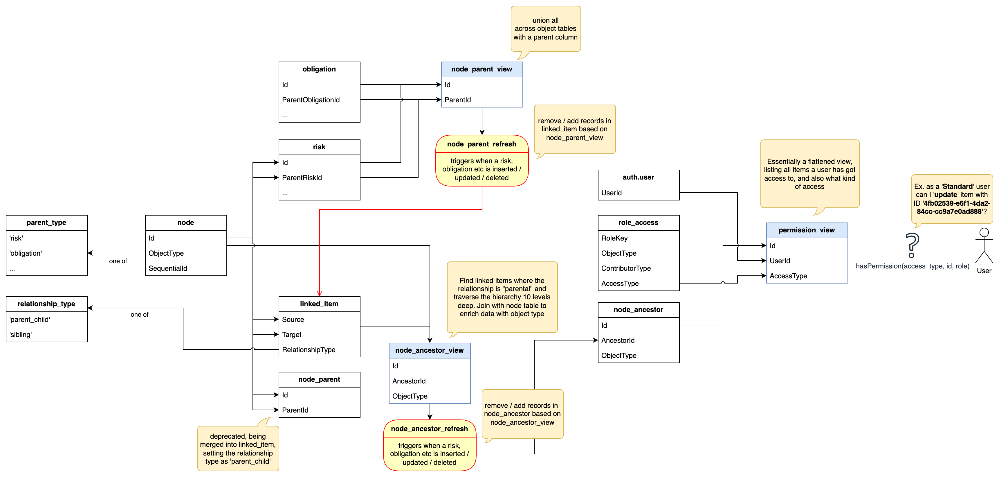

# API

<https://hasura.io/docs/latest/hasura-cli/install-hasura-cli/>

## Database

Consider installing SQLTools by mteixeira.dev to format you sql scripts.

### Logging all postgres SQL

Enable statement by logging by running the sql query

`SELECT set_config('log_statement', 'all', true);`

View the postgres logs by running:

`docker compose logs postgres --follow`

### Creating a migration

To create a new migration, run the command

```bash
pnpm hasura migrate create xyz --database-name default
```

from the hasura directory [documentation](<https://hasura.io/docs/latest/hasura-cli/commands/hasura_migrate_create/>

Execute by running the command

```bash
pnpm run hasura-migrate
```

Migrations cannot be altered.

## Exporting hasura metadata

```bash
pnpm hasura metadata export
```

### Creating seed data

<https://hasura.io/docs/latest/hasura-cli/commands/hasura_seed_create/>

`npx hasura seed create seed_name --database-name default`

### Table design

Many of the tables have common columns. These include:

Id - Unique identifier of the entity, but not always required as the record will often have a composite key e.g. Two ids for a many to many relationship
OrgKey - Organization key
CreatedByUser - The id of the user that created the record
ModifiedByUser - The id of the user that created the record
CreatedAtTimestamp - Created date
ModifiedAtTimestamp - Modified date

Each table will also have an \*\_audit table to track changes which should be populated using a trigger on its associated base table.
Search for risksmart.[table name]\_modified() to see an example trigger.

## Tables/Views



### When to Create Node Records

You need an associated node record in the following scenarios:

1. **Cross-table references with mixed types**: The record is referenced by another table where the column can include different types of objects, but you want to maintain referential integrity (e.g., a "ParentId" column that can reference multiple types of parents).

2. **Permission inheritance**: The record needs to inherit permissions from its parent (e.g., a control needs to be a node as it inherits permissions from parent risks).

3. **Type identification**: You want the ability to easily query what type of object is associated with a particular Id (useful for ParentId scenarios).

**Rule of thumb**: Don't create an associated node record unless you find out you need one!

### risksmart.node_type

An enumeration table that defines all valid node types within the system. Each record contains:

- `Value`: The node type identifier (e.g., 'settings_module', 'organisation_module', 'risk', 'control')
- `Comment`: Human-readable description of the node type

This table serves as the source of truth for valid node types and is referenced by the `risksmart.node` table. When creating a new table that requires node records, you must add the corresponding node type here:

```sql
INSERT INTO risksmart."node_type" ("Value", "Comment")
VALUES ('your_table_name', 'Your Table Description') ON CONFLICT DO NOTHING;
```

### risksmart.node

Contains the id, sequential id, and type of record of all other tables that are used within the permission hierarchy. It was created to improve the performance of recursive queries that check for ancestor items that have an associated contributor/owner record.

It can also be used to check the type of record for an Id within the customers org, regardless of whether they have access to the actual table record.

E.g. can access the risksmart.node record for risk a, even if I can't access the risksmart.risk record for risk a.

This table is kept up to date using triggers.

```sql
CREATE TRIGGER node_insert_trigger BEFORE
INSERT ON risksmart.[table] FOR EACH ROW EXECUTE PROCEDURE risksmart.node_insert();

CREATE TRIGGER node_delete_trigger
AFTER DELETE ON risksmart.[table] FOR EACH ROW EXECUTE PROCEDURE risksmart.node_delete();

ALTER TABLE risksmart.[table]
ADD CONSTRAINT "[table]_id_fkey" FOREIGN KEY ("Id") REFERENCES risksmart.node("Id");
```

### risksmart.node_ancestor

Contains the Id, ancestor id, type of object.
This table was again created to improve the performance of queries that check for an ancestor contributor/owner.

It allows you find ancestors without using recursive queries.

If is refreshed using triggers on changes to risksmart.linked_item and risksmart.node;

### risksmart.linked_item

All tables that have a child parent relationship that effects standard/standard enhanced user permissions need to update this table when they change, using the triggers shown below.

```sql
CREATE OR REPLACE TRIGGER linked_item_insert_trigger
AFTER
INSERT ON risksmart.risk REFERENCING NEW TABLE AS inserted FOR EACH STATEMENT EXECUTE PROCEDURE risksmart.linked_item_insert_with_[parent id column]();

CREATE OR REPLACE TRIGGER linked_item_delete_trigger
AFTER DELETE ON risksmart.risk REFERENCING OLD TABLE AS deleted FOR EACH STATEMENT EXECUTE PROCEDURE risksmart.linked_item_delete_with_[parent id column]();

CREATE OR REPLACE TRIGGER linked_item_update_trigger
AFTER
UPDATE ON risksmart.risk REFERENCING NEW TABLE AS inserted OLD TABLE AS deleted FOR EACH STATEMENT EXECUTE PROCEDURE risksmart.linked_item_update_with_[parent id column]();
```

These triggers run after a statement has been completed, inserting or deleting records into risksmart.linked_item;

### risksmart.role_access

Lists which tables/features are particular role has access to. Different access can be given based on the contributor type, which can be set to any (not necessarily a contributor or owner), contributor (user is a contributor of the item or any of its ancestors), or owner (use is owner of the item).

### risksmart.contributor_view

Lists the direct owners/contributors of a particular item. This view does not include inherited owners/contributors, but does show direct owners/contributors that are within a group.

## Clear down db

`docker compose down --volumes`

## Event / API Proxy

For local development, two more containers exist in the API Stack: `nginx & event-proxy.`
Instead of Hasura going straight to the API gateway and back to SST on the dev machines, a proxy is in place.
This proxy will forward any API requests that aren't to the `/events` endpoint directly to the API gateway, otherwise proxying the events to the event-proxy container.

The event proxy is an express server with 3 endpoints, which either black holes events or sends them on to the api gateway depending on whether the org key in the request has events enabled.
The purpose of this is it minimise events sent through the API / Eventbus / Lambdas during the setup phase without having to make any changes to the Hasura configuration, its all abstracted away inbetween the existing services.

### /events

Using axios to forward events to AWS API gateway if the org key in the event matches an org key that is enabled in global state. Otherwise returns a 200 to allow Hasura to believe its been processed without retrying.

### /enable-events

Sets the org key in the body to enabled, allowing event processing further in the stack

### /disable-events

Sets the org key in the body to disabled, stopping event processing further in the stack

## Rebuild API Proxy

`docker compose build event-proxy`

OR

`rebuildApiProxy.sh`

## Troubleshooting API Proxy / events

As there are now more services in play on the dev machines, theres more to debug if its not working!

### nginx

Check the nginx container logs to validate where the HTTP request was proxied and the status of the request.
`docker logs api-stack-nginx-1`

### event-proxy

Check the event proxy logs to validate if the event was meant to be processed or not.
`docker logs api-stack-event-proxy-1`
The container should log `orgKey: ${orgKey}. Processing events: ${sendEvents}` when the event endpoint is invoked, if the events were enabled and it failed, it'll log the full response body. Validate the API authentication has been proxied correctly if 401s are being returned.

### AWS

If the event appears to be proxied from the event proxy, however it isn't appearing in SST, check the event processing lambda in AWS as well the lambda you expect to be invoked by the event. Cases have been seen where issues with param store usage or other issues mean the event never arrives back on the dev laptop.

## Finding number of records referencing a particular primary

Note to use this function, postgres foreign keys are required to correctly show the results

`select * from risksmart.count_references('auth.user', 'auth0|644152102c766a09dd585d2e') where count>0`

## Getting latest copy of records before a particular date

```sql
select *
from
(select distinct on ("Id") *
from risksmart.[table]_audit r
where r."OrgKey" = [orgkey]
and r."ModifiedAtTimestamp" < [date]
order by r."Id", r."ModifiedAtTimestamp" desc) r
where r."Action" <> 'DELETE'
```

## Importing a Hasura import locally

Replace all "' with " characters
Replace all '" with " characters
Replace all "null" with null

Place in the postgres-init directory.

```sql
COPY [tableName](...columns)
FROM '/docker-entrypoint-initdb.d/[fileName]'
DELIMITER ','
CSV HEADER QUOTE '"' NULL 'null';
```
