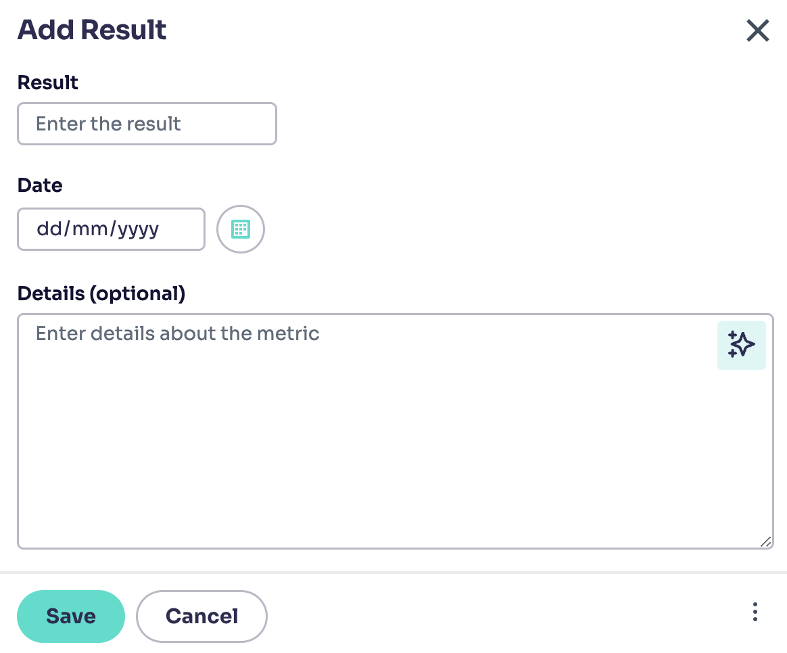
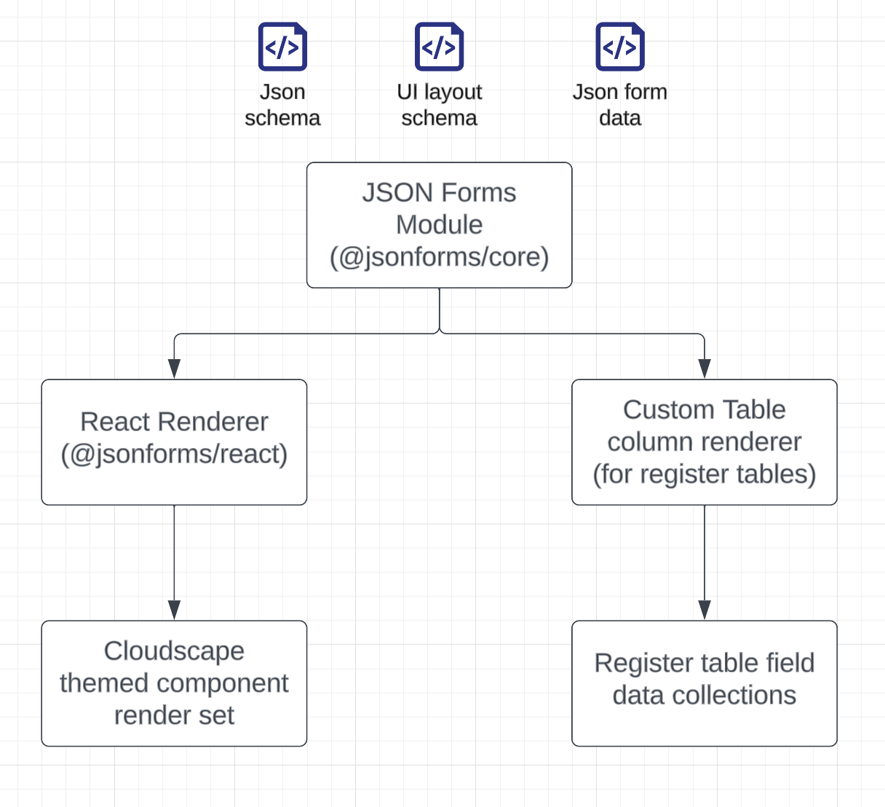

# Web App Forms

## Description

The RiskSmart application uses controlled structured forms to capture and display information related to the application objects (Risks, Policies, Obligations, Actions, issues, etc).

### Frontend form setup

#### React-hook-form controlled components

All forms and fields are controlled using the [react-hook-form](https://react-hook-form.com) module which provides state control, validation, and submission. Inside the RiskSmart app this is wrapped in a custom [form](../packages/web/src/components/Form/Form/Form.tsx) component which implements the react-hook-form control context provider, which is used by the form fields to provide control context. We also have a custom [controller](../packages/web/src/components/Form/field-controller/Controller.tsx) component that must be used in place of the standard react-hook-form controller.

### Customisable forms

Customisable forms are how most of the forms in the app are implemented, these forms allow admin users to add new custom attributes, reorder the fields, and control the behaviour of each form (e.g. changing optional fields to required fields or making certain fields read-only).

Please read the [customisable form documentation](./customisable-forms.md) for further information.

#### CloudScape UI form fields

The main form field UI components are provided from [cloudscape forms](https://cloudscape.design/components/form) via wrapped components which update styles and some behaviors (date input for example). All fields use within forms are present in [~/components/Form](../packages/web/src/components/Form/) and include a [`<Controller>`](https://www.react-hook-form.com/api/usecontroller/controller) to link the filed into the `react-hook-form` managed state.
Example form with cloudscape themed fields:

 

#### Form Validation

Form field validation is provided via [Zod](https://zod.dev). These are set out in [Schema](../packages/web/src/schemas/) files where validation logic, default values, and field type exports reside. Zod validation allows for custom error messaging, and extended rules (related field dependencies etc) which are passed into the `Form` component that uses a zod schema resolver to add validation into the `react-hook-form` controller. Typical validation schema takes the following shape:

```typescript
import { z } from 'zod';
const schema = z.object({
  Name: z.string().min(1, { message: 'Required' }),
  Rating: z
    .number()
    .min(1, { message: 'Required' })
    .max(5, { message: 'Required' }),
});
```

> Important:
>
> in order to mark a field as required, you must also add a `forceRequired={true}` prop to the form controller, this will prevent users from changing the field to 'non required' in the customisable forms.
>
> If you wish to make a field required by default, whilst offering users the ability to disable the required requirement, ensure that the schema allows for empty values and add a `defaultRequired={true}` prop to the controller.

#### Form component

All app forms in modals or on pages have been setup to work with a parent Form component which takes form fields as children. For example most forms follow this structure:

```typescript
import { useFormContext } from 'react-hook-form';
const { control } = useFormContext<AcceptanceFormFields>();
const values = {
  Name: 'john Doe',
  DateOfBirth: '1994/03/04',
};
const defaultValues = {
  Name: '',
  DateOfBirth: null,
};
const readOnly = false;
const onSave = (data) => console.log(data);
const onDismiss = () => undefined;
<Form
  formId="example-form"
  values={values}
  defaultValues={defaultValues}
  i18n={t('taxonomy-prefix-key')}
  onSave={onSave}
  onDismiss={onDismiss}
  schema={mySchema}
  readOnly={readOnly}
>
  <SpaceBetween direction="vertical" size="l">
    <ControlledInput
      disabled={readOnly}
      name="Name"
      forceRequired={true}
      label="Name"
      control={control}
      placeholder={'Enter name'}
    />
    <ControlledDatePicker
      name="DateOfBirth"
      forceRequired={true}
      label="Date of birth"
      control={control}
      disabled={readOnly}
    />
  </SpaceBetween>
</Form>;
```

This will wrap the form fields in controlled cloudscape components and add validation rules / errors defined in the zod schemas, also it adds submit & cancel buttons (which trigger the `onSave` or `onDismiss` provided functions to the Form component).

#### Custom attributes

Each form in the app has an added set of dynamic attribute fields. These are provided so that user's can add extra fields on top of the existing static form fields to add more tailored context to their objects. These dynamic fields are described using [Json Schema](https://json-schema.org/) and added to the UI using [Json Forms](https://jsonforms.io/docs). The high level design of the json forms UI rendering looks something like this:



The custom attribute configuration are provided to forms in the same way as the other controlled components. The [useControlledCustomAttributes](../packages/web/src/components/Form/custom-attributes/useControlledCustomAttributes.tsx) component can be used in any component, which returns an array of form fields which can be placed into any form.

The data to populate form fields is provided via the `react-hook-form` controller values as each entity stores its data directly in a `CustomAttribute` property which is returned from the DB column as part of the GraphQL data attributes.

Where the custom attribute fields differ in implementation from the static form fields is that validation is build into the Json Schema and does not use `Zod` validation schemas. Instead validation can be added to the Json schema for each form field, where it will be applied using the Json forms renderer (uses [ajv](https://ajv.js.org/)).

##### Adding, editing and deleting fields

Custom fields can be added to forms using the right hand 3-dot menu. This allows for a new schema to be added (if none exists) and fields to be added. The result from adding or editing data is a set of Json schema & UI layout schema documents:

fields schema:

```json
{
  "properties": {
    "1698845323648_text": {
      "type": "string",
      "description": "uischema defined text input"
    },
    "1698845360831_date": {
      "type": "string",
      "format": "date",
      "description": "uischema defined date picker"
    },
    "1698845400619_select": {
      "enum": ["option 1", "another opt", "option3", "foo"],
      "type": "string"
    },
    "1698845337953_textarea": {
      "type": "string",
      "description": "uischema defined text area"
    }
  }
}
```

UI Layout schema:

```json
{
  "type": "VerticalLayout",
  "elements": [
    {
      "type": "Control",
      "label": "Some text input",
      "scope": "#/properties/1698845323648_text"
    },
    {
      "type": "Control",
      "label": "Some text area",
      "scope": "#/properties/1698845337953_textarea"
    },
    {
      "type": "Control",
      "label": "Example date input",
      "scope": "#/properties/1698845360831_date"
    },
    {
      "type": "Control",
      "label": "Dropdown with options",
      "scope": "#/properties/1698845400619_select"
    }
  ]
}
```

These schemas are saved via [GraphQL queries](../packages/web/src/data/graphql/customAttributeSchemas) into the DB table `custom_attribute_schema` and mapped to each parent type (Risk, Obligation, Issue, etc) using `Custom_attribute_schema_parent`.
