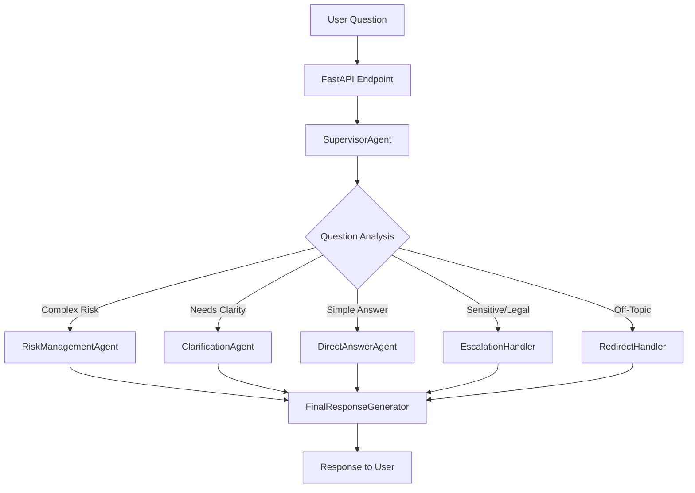

# AI Engine Multi-Agent Risk Management System

## Overview

This document provides a comprehensive technical overview of the AI Engine's multi-agent risk management system, implemented as part of the RiskSmart application's AI capabilities.

## System Architecture

### High-Level Design

The AI Engine implements a sophisticated **supervisor-driven multi-agent conversational AI system** specifically designed for risk management guidance. The architecture follows enterprise-grade patterns with clear separation of concerns, robust error handling, and comprehensive observability.



### Technology Stack

- **LangGraph**: Workflow orchestration and state management
- **AWS Bedrock**: LLM backend (Anthropic Claude 3 Sonnet)
- **FastAPI**: REST API framework
- **Pydantic**: Data validation and serialization
- **Auth0**: JWT-based authentication
- **Python 3.13+**: Runtime environment

## Core Components

### 1. State Management (`RiskManagementState`)

The system uses a centralized state object that tracks the entire conversation flow:

```python
class RiskManagementState(TypedDict):
    # Core conversation
    question: str
    conversation_history: List[Dict[str, str]]

    # Supervisor analysis
    supervisor_reasoning: Optional[str]
    current_plan: Optional[str]
    supervisor_action: Optional[str]
    question_category: Optional[str]

    # Agent outputs
    risk_response: Optional[str]
    clarification_question: Optional[str]
    final_answer: Optional[str]

    # Control flow
    requires_human_escalation: bool
    is_off_topic: bool
    error_message: Optional[str]
    iteration_count: int
    max_iterations: int
```

**Key Features:**

- Immutable state transitions
- Complete conversation history tracking
- Error state management
- Iteration control for loop prevention

### 2. Agent Architecture

#### Base Agent Pattern

All agents inherit from `BaseAgent` which provides:

- AWS Bedrock LLM integration
- Consistent error handling
- Conversation history management
- Configurable model parameters

```python
class BaseAgent(ABC):
    def __init__(self, model: Optional[str] = None,
                 temperature: Optional[float] = None,
                 max_tokens: Optional[int] = None):
        self.llm = ChatBedrockConverse(
            model=model or settings.DEFAULT_MODEL,
            temperature=temperature or settings.AGENT_TEMPERATURE,
            max_tokens=max_tokens or settings.MAX_TOKENS,
            region_name=settings.AWS_REGION
        )

    @abstractmethod
    def process(self, state: RiskManagementState) -> RiskManagementState:
        pass
```

#### Specialized Agents

**SupervisorAgent**

- **Purpose**: Intelligent question analysis and workflow routing
- **Key Features**:
  - JSON-structured decision making
  - Risk domain categorization
  - Off-topic detection
  - Escalation decision logic
- **Temperature**: 0.3 (consistent routing decisions)

**RiskManagementAgent**

- **Purpose**: Domain expert for comprehensive risk guidance
- **Expertise Areas**:
  - Enterprise Risk Management (COSO, ISO 31000)
  - Regulatory compliance (SOX, GDPR, HIPAA)
  - Cybersecurity and information security
  - Operational risk and business continuity
  - Financial risk controls
- **Temperature**: 0.2 (factual, consistent guidance)

**ClarificationAgent**

- **Purpose**: Generate targeted questions for ambiguous queries
- **Strategy**: Provides 3-4 specific clarifying questions to help users narrow their needs
- **Example Output**: "Are you looking for help with regulatory compliance, operational risk, or cybersecurity?"

**DirectAnswerAgent**

- **Purpose**: Handle simple risk definitions and basic information
- **Use Cases**: Risk terminology, basic concept explanations, quick factual responses

**EscalationHandler**

- **Purpose**: Route complex/sensitive matters to human experts
- **Triggers**:
  - Organization-specific policy questions
  - Legal/regulatory matters requiring specialized expertise
  - Strategic risk decisions requiring human judgment
  - Real-time crisis situations

**RedirectHandler**

- **Purpose**: Politely redirect off-topic questions back to risk domain
- **Approach**:
  - Acknowledge the question respectfully
  - Explain the system's risk management focus
  - Suggest risk-related alternatives
  - Maintain professional, helpful tone

**FinalResponseGenerator**

- **Purpose**: Consolidate responses and ensure consistent output formatting
- **Functions**:
  - Response prioritization (risk response > error > fallback)
  - Error state handling
  - Consistent formatting
  - Fallback response generation

### 3. Workflow Orchestration

The system uses LangGraph's StateGraph for sophisticated workflow management:

```python
def create_risk_management_workflow():
    workflow = StateGraph(RiskManagementState)

    # Add all agent nodes
    workflow.add_node("supervisor", supervisor.process)
    workflow.add_node("risk_agent", risk_agent.process)
    workflow.add_node("clarification", clarification.process)
    # ... other agents

    # Set supervisor as entry point
    workflow.set_entry_point("supervisor")

    # Add conditional routing
    workflow.add_conditional_edges(
        "supervisor",
        supervisor_router,
        {
            "risk_agent": "risk_agent",
            "clarification": "clarification",
            # ... other routes
        }
    )

    return workflow.compile()
```

#### Routing Logic

**supervisor_router()**

- Maps supervisor decisions to appropriate agents
- Implements iteration limits (max 3 attempts)
- Provides fallback routing for unknown actions
- Safety valve for infinite loop prevention

**post_agent_router()**

- Determines next steps after agent responses
- Handles error states with retry logic
- Routes to final response when complete

### 4. Domain Configuration

#### Risk Management Domains (In Scope)

- Enterprise Risk Management (ERM)
- Regulatory Compliance (SOX, GDPR, HIPAA, etc.)
- Cybersecurity & Information Security
- Operational Risk Management
- Financial Risk Controls
- Business Continuity Planning
- Vendor/Third-party Risk
- Governance & Risk Reporting
- Risk Assessment & Monitoring
- Risk Culture & Training
- Crisis Management & Response

#### Off-Topic Domains (Out of Scope)

- General business advice unrelated to risk
- Technical implementation details (unless risk-related)
- HR/Personnel matters (unless risk-related)
- Marketing, sales, or customer service
- General IT support
- Legal advice (escalated to experts)
- Financial planning or investment advice
- Product development (unless risk assessment)

#### Category Expertise Mapping

```python
CATEGORY_EXPERTISE = {
    "compliance": "Focus on regulatory requirements, audit processes, and compliance frameworks",
    "cybersecurity": "Emphasize security controls, threat assessment, and information security management",
    "operational": "Address process risks, operational controls, and business continuity",
    "financial": "Cover financial controls, fraud prevention, and financial risk management",
    "governance": "Discuss risk governance, board reporting, and organizational risk culture"
}
```

## Configuration Management

### Environment Variables

#### AWS Bedrock Configuration

```env
AWS_REGION=us-east-1
AWS_ACCESS_KEY_ID=your-access-key-id
AWS_SECRET_ACCESS_KEY=your-secret-access-key
DEFAULT_MODEL=anthropic.claude-3-sonnet-20240229-v1:0
```

#### Agent Temperature Settings

```env
SUPERVISOR_TEMPERATURE=0.3  # Consistent routing decisions
AGENT_TEMPERATURE=0.2       # Factual risk guidance
MAX_TOKENS=800             # Response length control
```

#### Workflow Control

```env
MAX_ITERATIONS=3                    # Loop prevention
ENABLE_HUMAN_ESCALATION=true       # Expert escalation
ENABLE_OFF_TOPIC_REDIRECT=true     # Domain boundary enforcement
```

## Usage Patterns

### Complex Risk Assessment

**Input**: "How do I implement a cybersecurity risk assessment framework for a healthcare organization?"

**Flow**:

1. Supervisor analyzes → categorizes as "cybersecurity" + "compliance"
2. Routes to RiskManagementAgent
3. Agent provides healthcare-specific guidance including HIPAA considerations
4. FinalResponseGenerator formats comprehensive response

### Ambiguous Query

**Input**: "Tell me about risk management"

**Flow**:

1. Supervisor detects broad/unclear question
2. Routes to ClarificationAgent
3. Agent generates targeted questions about domain, industry, objectives
4. User guided toward specific actionable advice

### Off-Topic Handling

**Input**: "How do I increase sales for my product?"

**Flow**:

1. Supervisor detects off-topic content
2. Routes to RedirectHandler
3. Agent politely redirects to risk-related aspects (market risk, business risk)
4. Maintains professional boundaries while being helpful

## Error Handling & Resilience

### Error Recovery Patterns

- **LLM Call Failures**: Structured exception handling with specific error types
- **JSON Parsing Failures**: Fallback parsing for supervisor decisions
- **Agent Errors**: Graceful degradation to simpler responses
- **Iteration Limits**: Safety valve prevents infinite loops
- **State Corruption**: Immutable state transitions prevent cascading failures

### Monitoring & Observability

- Request tracing with unique IDs
- Agent decision logging
- Performance metrics (processing time, iteration counts)
- Error categorization and reporting
- Conversation flow analytics

## Integration Status

### Current Implementation

- ✅ Complete multi-agent system architecture
- ✅ LangGraph workflow orchestration
- ✅ AWS Bedrock integration
- ✅ Comprehensive error handling
- ✅ Configuration management
- ✅ Authentication and authorization

### Pending Integration

- ⏳ FastAPI endpoint integration
- ⏳ Session persistence
- ⏳ Conversation history management
- ⏳ Comprehensive testing suite
- ⏳ Performance monitoring
- ⏳ Production deployment configuration

### Next Steps

1. **Immediate**: Complete integration in `/invoke` endpoint
2. **Short-term**: Add session management and testing
3. **Medium-term**: Performance optimization and monitoring
4. **Long-term**: Advanced features (memory, personalization)

## Technical Considerations

### Performance

- **Response Time**: Target <2 seconds for most queries
- **Concurrency**: Async-capable with FastAPI
- **Scalability**: Stateless agents enable horizontal scaling
- **Cost Management**: Token limits and request batching

### Security

- **Authentication**: JWT-based with Auth0
- **Authorization**: Feature-based access control
- **Data Privacy**: No persistent storage of conversation content
- **Error Disclosure**: Sanitized error messages to prevent information leakage

### Maintainability

- **Modular Design**: Clear separation between agents
- **Configuration-Driven**: Environment-based configuration
- **Extensible**: Easy to add new agents or modify routing
- **Testable**: Each component can be unit tested independently

## Conclusion

The AI Engine's multi-agent risk management system represents a sophisticated approach to domain-specific AI assistance. The architecture prioritizes reliability, maintainability, and user experience while maintaining strong boundaries around risk management expertise.

The system demonstrates enterprise-ready patterns including comprehensive error handling, observability, security, and scalability considerations. Once integration is complete, it will provide RiskSmart users with intelligent, contextual risk management guidance that adapts to their specific needs and expertise levels.
