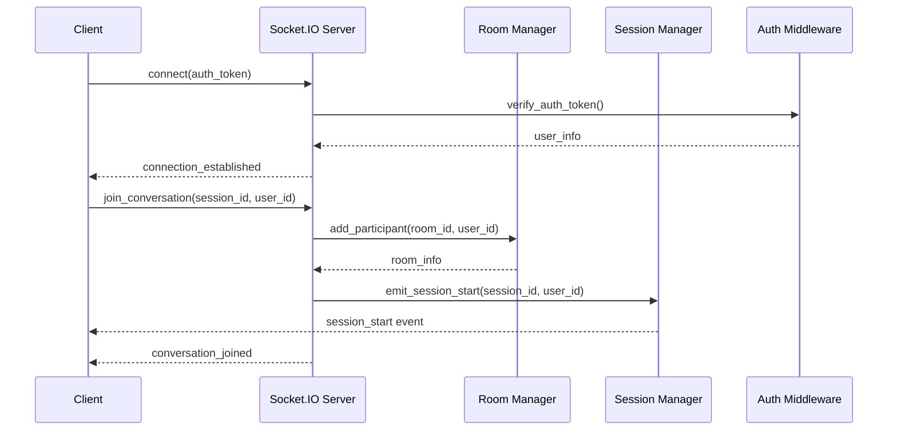
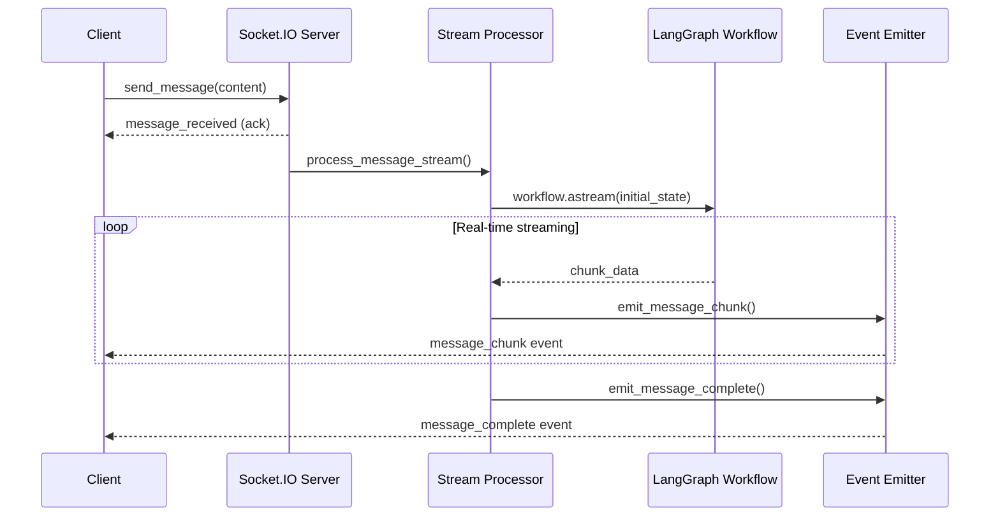
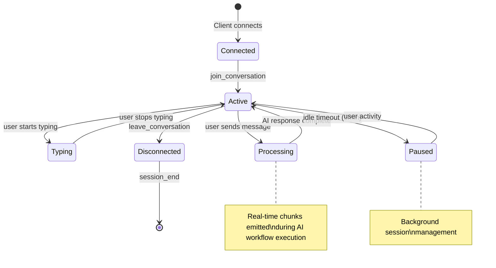
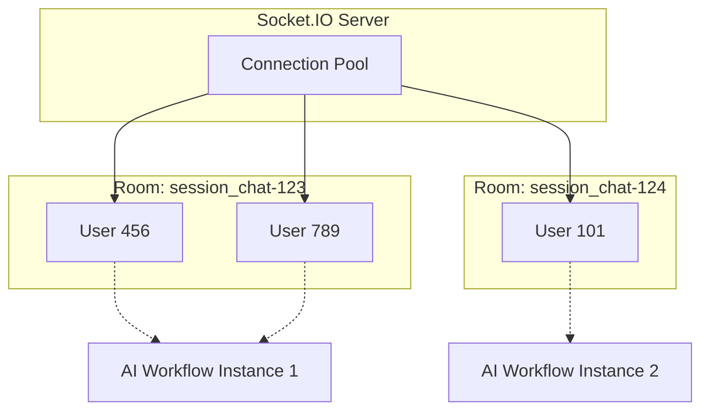
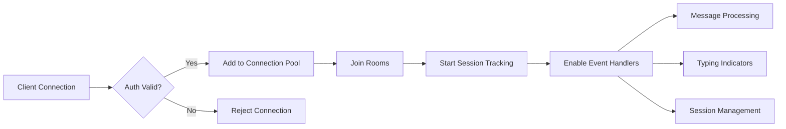

# Socket.IO Chat Events Flow Documentation

## Overview

This document explains how Socket.IO events flow during a user's chat session in the RiskSmart AI Chat Agent, detailing the real-time interaction patterns between clients and the AI workflow system.

## Architecture Components

Our Socket.IO implementation consists of several key components:

- **ChatSocketIOServer**: Main Socket.IO server handling connections
- **RoomManager**: Manages chat rooms and user participation
- **SessionManager**: Handles session lifecycle events
- **StreamProcessor**: Processes real-time AI responses
- **EventEmitter**: Coordinates event emission to clients
- **WorkflowStreamer**: Integrates with LangGraph workflows

## Event Flow Diagrams

### 1. Connection & Room Setup Flow



### 2. Real-Time Message Streaming Flow



### 3. Session Lifecycle Management



## Detailed Event Flow

### 1. Connection & Room Setup

#### Events Sequence:

```typescript
// 1. Client Connection
Client → Server: connect({token: "jwt_token"})
Server → Client: "connection_established" {
  user_id: "user-456",
  connection_id: "conn-789"
}

// 2. Join Conversation
Client → Server: "join_conversation" {
  session_id: "chat-123",
  user_id: "user-456"
}
Server → Client: "conversation_joined" {
  room_id: "session_chat-123",
  participants: ["user-456"],
  room_info: {created_at: "2025-07-31T10:00:00Z"}
}

// 3. Session Start
Server → Room: "session_start" {
  session_id: "chat-123",
  user_id: "user-456",
  started_at: 1722423600,
  metadata: {}
}
```

### 2. Real-Time Messaging Flow

#### Typing Indicators:

```typescript
// User starts typing
Client → Server: "typing_start" {session_id: "chat-123"}
Server → Room: "user_typing" {
  user_id: "user-456",
  username: "John Doe",
  session_id: "chat-123"
}

// User stops typing
Client → Server: "typing_stop" {session_id: "chat-123"}
Server → Room: "user_stopped_typing" {
  user_id: "user-456",
  session_id: "chat-123"
}
```

#### Message Processing:

```typescript
// 1. Send Message
Client → Server: "send_message" {
  session_id: "chat-123",
  content: "What are the key risks in cloud migration?",
  user_id: "user-456"
}
Server → Client: "message_received" (acknowledgment)

// 2. Real-time AI Response Streaming
Server → Room: "message_chunk" {
  session_id: "chat-123",
  chunk_id: "chunk-1",
  content: "Cloud migration involves",
  chunk_index: 0,
  is_final: false,
  metadata: {
    response_id: "resp-789",
    workflow_step: "supervisor_analysis"
  }
}

Server → Room: "message_chunk" {
  session_id: "chat-123",
  chunk_id: "chunk-2",
  content: " several key risks including:",
  chunk_index: 1,
  is_final: false,
  metadata: {
    response_id: "resp-789",
    workflow_step: "risk_assessment"
  }
}

// ... more chunks ...

// 3. Final Completion
Server → Room: "message_complete" {
  session_id: "chat-123",
  message: {
    role: "assistant",
    content: "Cloud migration involves several key risks including data security, downtime, compliance issues, and cost overruns...",
    metadata: {
      model: "claude-3-sonnet",
      workflow_iterations: 2,
      processing_time_ms: 1200
    }
  },
  response_id: "resp-789",
  total_chunks: 8,
  metadata: {
    processing_time_ms: 1200,
    workflow_execution: {
      iterations_used: 2,
      supervisor_action: "provide_risk_analysis",
      question_category: "risk_assessment"
    }
  }
}
```

### 3. Session Management Events

#### Background Session Lifecycle:

```typescript
// Auto-pause after inactivity
Server → Room: "session_pause" {
  session_id: "chat-123",
  user_id: "user-456",
  paused_at: 1722423900,
  metadata: {reason: "inactivity_timeout"}
}

// Resume on user activity
Server → Room: "session_resume" {
  session_id: "chat-123",
  user_id: "user-456",
  resumed_at: 1722424200,
  metadata: {trigger: "user_activity"}
}

// Session end
Server → Room: "session_end" {
  session_id: "chat-123",
  user_id: "user-456",
  ended_at: 1722424800,
  metadata: {
    duration_seconds: 1200,
    messages_exchanged: 15
  }
}
```

### 4. Error Handling

```typescript
// Error during AI processing
Server → Room: "error" {
  error: "AI service temporarily unavailable",
  error_code: "PROCESSING_ERROR",
  session_id: "chat-123",
  details: {
    error_type: "BotoCoreError",
    request_id: "req-456",
    timestamp: 1722423700
  }
}
```

## LangGraph Workflow Integration

### Real-time Streaming Implementation

```python
# In StreamProcessor.process_stream()
async for chunk in workflow.astream(initial_state):
    chunk_content = self._extract_streaming_content(chunk)
    if chunk_content:
        await self.event_emitter.emit_message_chunk(
            sio, room_id, session_id, {
                'content': chunk_content,
                'workflow_step': self._get_workflow_step_name(chunk)
            }
        )
```

### Workflow Step Mapping

```mermaid
graph TD
    A[User Message] --> B[Supervisor Analysis]
    B --> C[Question Classification]
    C --> D[Risk Assessment]
    D --> E[Response Generation]
    E --> F[Final Answer]

    B -.-> G[message_chunk: "Analyzing your question..."]
    C -.-> H[message_chunk: "This appears to be about..."]
    D -.-> I[message_chunk: "Key risks include..."]
    E -.-> J[message_chunk: "Based on analysis..."]
    F -.-> K[message_complete: Full response]
```

## Room Management Architecture

### Room Isolation Strategy



### Participant Management

```typescript
interface RoomParticipant {
  user_id: string;
  connection_id: string;
  joined_at: number;
  last_activity: number;
  permissions: string[];
}

interface Room {
  room_id: string;
  session_id: string;
  participants: RoomParticipant[];
  created_at: number;
  last_activity: number;
  metadata: {
    conversation_type: 'ai_chat' | 'human_chat';
    max_participants: number;
  };
}
```

## Performance & Scalability Considerations

### Event Emission Patterns

1. **Unicast**: Direct to specific user (errors, acknowledgments)
2. **Room Broadcast**: To all room participants (chunks, typing indicators)
3. **Background Events**: Session lifecycle (pause/resume/end)

### Connection Management



## Configuration & Settings

### Event Rate Limiting

```python
# In settings
SOCKET_IO_CONFIG = {
    "ping_interval": 25,
    "ping_timeout": 60,
    "max_http_buffer_size": 1000000,  # 1MB
}

SESSION_CONFIG = {
    "idle_timeout_minutes": 5,
    "max_session_duration_hours": 8,
    "chunk_emission_delay_ms": 100,  # For mock mode
}
```

### Error Recovery Patterns

```python
# Automatic retry logic in StreamProcessor
if should_retry_streaming(error, attempt_count):
    delay = get_retry_delay(error, attempt_count)
    await asyncio.sleep(delay)
    # Retry with exponential backoff
```

## Monitoring & Debugging

### Event Logging

All events are logged with structured context:

```python
logger.info(
    f"Emitted {event_type} to room {room_id}",
    extra={
        "session_id": session_id,
        "user_id": user_id,
        "event_type": event_type,
        "processing_time_ms": processing_time,
        "chunk_count": chunk_count
    }
)
```

### Health Checks

- Connection count monitoring
- Room participant tracking
- Session duration analytics
- Error rate monitoring by event type

This architecture provides a robust, real-time chat experience with proper separation of concerns, error handling, and scalability considerations for the RiskSmart AI platform.
