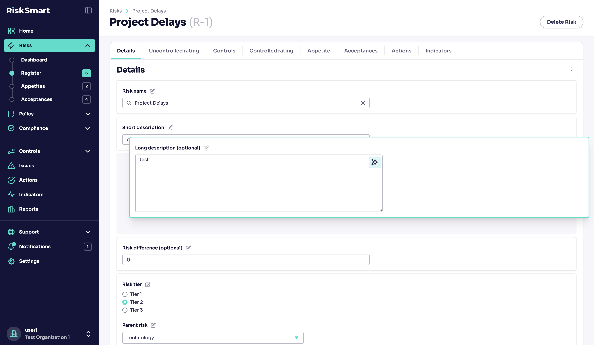

- [Introduction](#introduction)
- [Custom form components](#custom-form-components)
  - [CustomisableForm](#customisableform)
    - [Example of a normal form vs a customisable form](#example-of-a-normal-form-vs-a-customisable-form)
      - [Normal form](#normal-form)
      - [Customisable form](#customisable-form)
  - [FieldGroup](#fieldgroup)
  - [ConditionalField](#conditionalfield)
- [Extra reading](#extra-reading)

# Introduction

Customisable forms are how most of the forms in the app are implemented, these forms allow admin users to add new custom attributes, reorder the fields, and control the behaviour of each form (e.g. changing optional fields to required fields or making certain fields read-only).



# Custom form components

## Go to → [CustomisableForm](../packages/web/src/components/Form/Form/customisable-form/CustomisableForm.tsx)

The `CustomisableForm` component is used to transform a series of form fields inside a form to a customisable form. The component must be used as a child to the generic [Form](../packages/web/src/components/Form/Form/Form.tsx) component. In order to transform a form into a customisable one, you must first fulfil a few requirements.

- Each direct child of `CustomisableForm` must have a unique [key](https://react.dev/learn/rendering-lists#rules-of-keys). The key is required for the component to facilitate reordering of fields.
- Each form field must be wrapped in the [`Controller`](../packages/web/src/components/Form/field-controller/Controller.tsx) component. Note: most of the form field components that have been implemented are already wrapped in this controller anyway.

### Example of a normal form vs a customisable form

#### Normal form

```tsx
<Form {...formProps}>
  <SpaceBetween direction="vertical" size="l">
    <ControlledInput
      disabled={readOnly}
      name="Name"
      label="Name"
      control={control}
      placeholder={'Enter name'}
    />
    <ControlledDatePicker
      name="DateOfBirth"
      label="Date of birth"
      control={control}
      disabled={readOnly}
    />
  </SpaceBetween>
</Form>
```

#### Customisable form

```tsx
<Form {...formProps}>
  <CustomisableForm readOnly={readOnly}>
    <ControlledInput
      key="nameInput"
      disabled={readOnly}
      name="Name"
      label="Name"
      control={control}
      placeholder={'Enter name'}
    />
    <p key="textElement">
      You can add any HTML element to the form, all children must still have a key like this `<p>` tag. The end-user will be able
      to re-order this as well just like any other element in the form.
    </p>
    <ControlledDatePicker
      key="dob"
      name="DateOfBirth"
      label="Date of birth"
      control={control}
      disabled={readOnly}
    />
  </CustomisableForm>
</Form>
```

> Note: The keys can be anything you want, so long as they are unique. Once the keys are set, you should not change them as it could alter the field order after it has been customised.

## [FieldGroup](../packages/web/src/components/Form/Form/customisable-form/FieldGroup.tsx)

A lot of the time fields can be closely related and you may want to keep them together. To do this you can wrap a group of fields in the `FieldGroup` component. Fields inside this component do not need to have a key, however the `FieldGroup` does because it is the direct child of `CustomisableForm`.

```tsx
<Form {...formProps}>
  <CustomisableForm readOnly={readOnly}>
    <ControlledInput
      key="nameInput"
      disabled={readOnly}
      name="Name"
      label="Name"
      control={control}
      placeholder={'Enter name'}
    />
    <FieldGroup key="birthDetails">
      <h2>
        Personal details
      </p>
      <ControlledDatePicker
        name="DateOfBirth"
        label="Date of birth"
        control={control}
        disabled={readOnly}
      />
      <ControlledInput
        disabled={readOnly}
        name="Birthplace"
        label="Place of Birth"
        control={control}
        placeholder={'Where were you born?'}
      />
    </FieldGroup>
  </CustomisableForm>
</Form>
```

## [ConditionalField](../packages/web/src/components/Form/Form/customisable-form/ConditionalField.tsx)

Some fields you may want to show/hide conditionally depending on the current state of the form. You may be inclined to use a standard ternary operator or the && operator to do this like you might normally. However this isn't great because when the form is in edit mode, the user won't be able to see the form in its entirity. The `ConditionalField` component shows/hides its content depending on a boolean expression, but if the form is in edit mode, it will always show its children.

```tsx
<Form {...formProps}>
  <CustomisableForm readOnly={readOnly}>
    <ControlledInput
      key="nameInput"
      disabled={readOnly}
      name="Name"
      label="Name"
      control={control}
      placeholder={'Enter name'}
    />
    <FieldGroup key="birthDetails">
      <h2>
        Personal details
      </p>
      <ControlledDatePicker
        name="DateOfBirth"
        label="Date of birth"
        control={control}
        disabled={readOnly}
      />
      <ControlledInput
        disabled={readOnly}
        name="Birthplace"
        label="Place of Birth"
        control={control}
        placeholder={'Where were you born?'}
      />
      <ConditionalField condition={age > 18}>
        <ControlledInput
          disabled={readOnly}
          name="FavouriteAlcohol"
          label="What's your favourite alcohol to drink?"
          control={control}
          placeholder={'Kraken Rum'}
        />
      </ConditionalField>
    </FieldGroup>
  </CustomisableForm>
</Form>
```

# Extra reading

The CustomisableForm component in is designed to create a form with customizable fields. It uses a hook `useTransformSchemaToRequiredFields` to transform the schema into required fields based on the parentType.

The `useElementsOrder` hook is used to manage the order and visibility of form elements. It takes:

- `elementsByKey` (a map of form elements by their keys)
- `fieldOrdering` (an optional ordering configuration)
- and a boolean indicating whether `fieldOrdering` exists

The `saveFields` function is a callback that is used to save the positions of form fields. It checks if `parentType` and `elementsOrder` exist, and then decides whether to update or insert form field positions based on the updating flag. The function then calls the appropriate mutation function (`updateFormFieldPositions` or `insertFormFieldPositions`) with the necessary variables.

The variables include `fieldConfig` (an array of form field configurations), `fieldIds` (an array of form field IDs), and `parentType`. The `fieldConfig` is created by mapping over `elementsOrder` and creating an object for each element with properties `FormConfigurationParentType`, `FieldId`, `Position`, and `form`.
