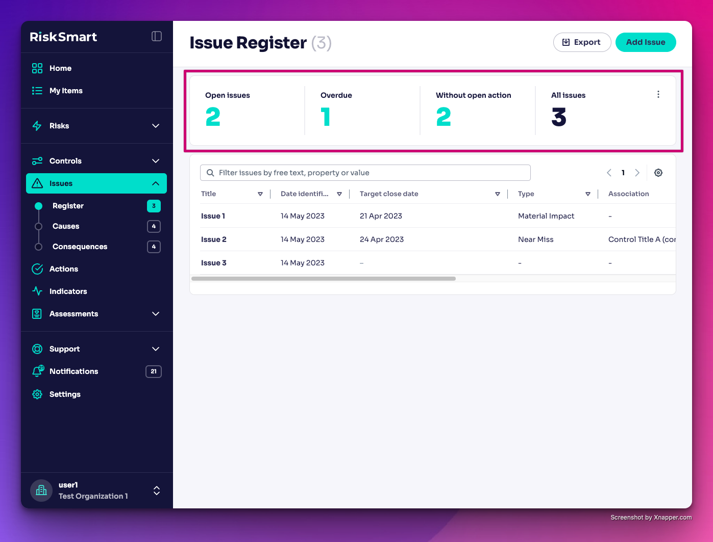
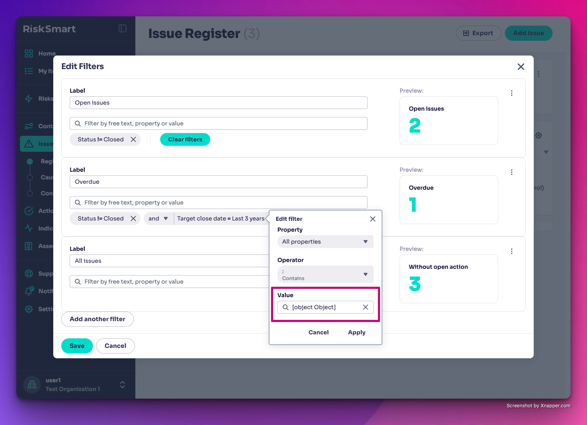
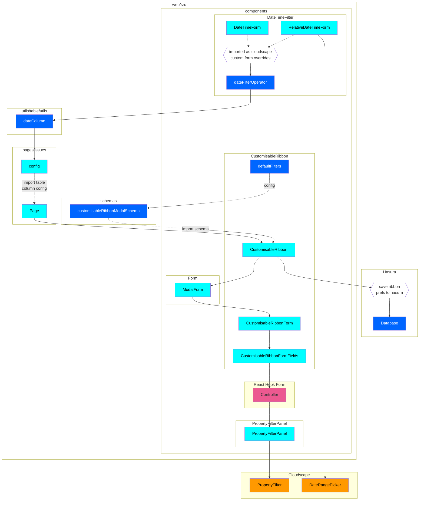

# Customisable Ribbons

## Overview

Customisable Ribbons are a feature that allow users to customise and save the quick filters that are displayed above a table.
As of writing (01/09/2024) the dashboard can only be saved by admin users and saved at the org level. This means users cannot currently save their own customisable ribbons.

## Go to → [CustomisableRibbons](../packages/web/src/components/customisable-ribbon/CustomisableRibbon.tsx)

## Notes

Customisable Ribbons are:

- Configured by:
  - Page Config: `packages/web/src/pages/{ENTITY_NAME}/config.tsx`
  - Widget Data Source: `packages/web/src/pages/dashboards/UniversalWidget/data-sources/{ENTITY_NAME}.ts`
- Custom dropdown forms configured in `components/date-time-filter/dateFilterOperator.ts` which is then used by the `dateColumn` utility
- Imported into the `pages/{ENTITY_NAME}/Page.tsx` file

## Known Issues

- Runtime error when selecting a property that uses a relative date time filter
  - Select a property that uses a relative date time filter
  - Click on the filter to edit
  - Click the dropdown under the label 'Property'
  - Scroll up to the top and select the 'All Properties' option
  - The value will not be cleared which will cause the date object to be cast to a string
  - Click this and it will cause a runtime error
  - **SOLUTION:** Update Cloudscape to fix this issue

- Adding a custom date filter field to an issue table introduces runtime errors when combined with a clickthrough filter
- Last / Next {TIME_PERIOD} filters don't include today's date

## Architecture

_To view native mermaid diagrams in markdown files, you can use the Mermaid Plugin_

