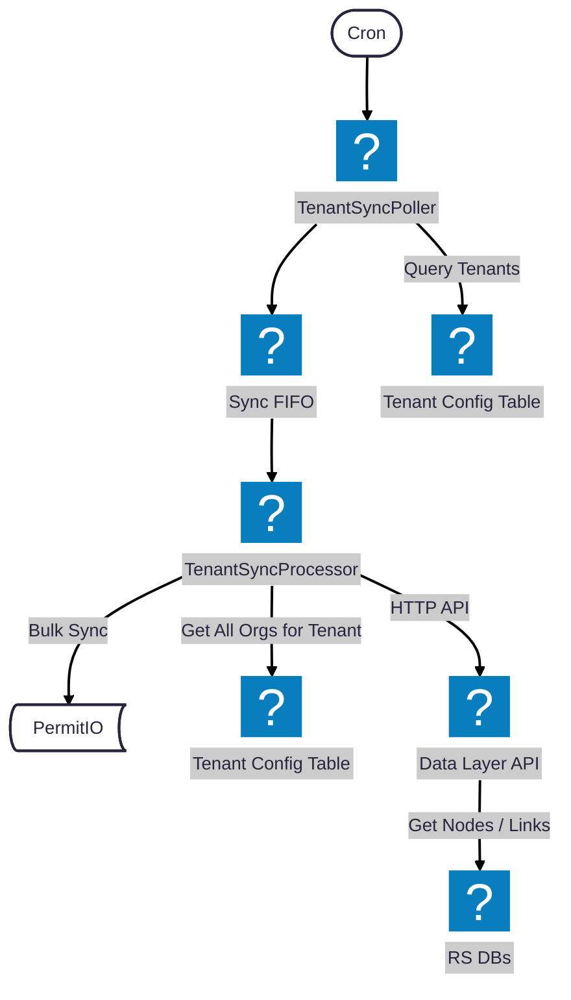

# Permissions Sync Overview

This document describes the architecture and process for synchronizing permissions between RiskSmart databases and PermitIO.

## Purpose

The permissions sync system ensures that PermitIO (our authorization service) stays in sync with the current state of:

- **Organizations (Tenants)** - Each organization in RiskSmart maps to a tenant in PermitIO
- **Users** - User accounts that need authorization
- **User Groups** - Groups used for role-based access control
- **Resource Instances** - Individual objects (risks, controls, actions, etc.) that need permission checks
- **Relationships** - Parent-child relationships between objects and group memberships
- **Ownership & Roles** - User ownership and contributor relationships to resources

## Architecture Diagram



## Infrastructure Components

### 1. TenantSyncPoller (Lambda)

**Trigger**: Cron schedule (every hour)

**Responsibilities**:

- Queries the `GlobalTenantConfig` DynamoDB table to get all active tenants
- Sends a sync message to the Sync FIFO Queue for each tenant
- Uses `MessageGroupId` (tenant ID) to ensure FIFO ordering per tenant

**Location**: `services/permissions/src/handlers/tenant-sync-poller.ts`

### 2. Sync FIFO Queue (SQS)

**Type**: FIFO Queue with content-based deduplication

**Configuration**:

- Queue name: `{region}-{stage}-tenant-sync-queue.fifo`
- Visibility timeout: 6 minutes (slightly longer than processor timeout)
- Message retention: 4 days
- Dead letter queue: `{region}-{stage}-tenant-sync-dlq.fifo` (max 3 retries)

**Purpose**:

- Decouples the polling from processing
- Ensures ordered processing per tenant via MessageGroupId
- Provides reliability through DLQ for failed messages

### 3. TenantSyncProcessor (Lambda)

**Trigger**: SQS Event Source (batch size: 1)

**Responsibilities**:

1. Receives sync messages from the FIFO queue
2. For each tenant, queries all organizations from the Tenant Config Table
3. Calls the Data Layer API to retrieve object data (nodes, user groups, owners, etc.)
4. Performs the full sync process for each organization

**Location**: `services/permissions/src/handlers/tenant-sync-processor.ts`

### 4. Data Layer API (Lambda)

**Type**: REST API Gateway with Lambda handler

**Responsibilities**:

- Provides HTTP endpoints for accessing object data from RiskSmart databases
- Handles database connections and tenant-specific schema access
- Returns data in a format optimized for the sync process

**Endpoints**:

| Endpoint                 | Method | Description                                    |
| ------------------------ | ------ | ---------------------------------------------- |
| `/nodes`                 | GET    | Get all nodes for an organization              |
| `/user-groups`           | GET    | Get all user groups for an organization        |
| `/user-group-users`      | GET    | Get all user group user assignments            |
| `/linked-items`          | GET    | Get all parent-child linked items              |
| `/owners`                | GET    | Get all owners for an organization             |
| `/contributors`          | GET    | Get all contributors for an organization       |
| `/owner-groups`          | GET    | Get all owner groups for an organization       |
| `/contributor-groups`    | GET    | Get all contributor groups for an organization |
| `/user-roles`            | GET    | Get all user roles for an organization         |
| `/organisations/by-keys` | POST   | Get organisations by orgKeys                   |
| `/users`                 | GET    | Get all users for the tenant                   |

**Location**: `services/data-layer/src/handlers/http/handler.ts`

### 5. Tenant Config Table (DynamoDB)

**Table**: `{stage}-risksmartApp-GlobalTenantConfig`

**Purpose**:

- Stores configuration for all tenants and their organizations
- Used by both Poller (get all tenants) and Processor (get orgs for tenant)

### 6. RS DBs (Aurora PostgreSQL)

**Purpose**:

- Contains the source of truth for all object data:
  - `node` table - Resource instances (risks, controls, etc.)
  - `linked_item` table - Parent-child relationships
  - `user_group` and `user_group_user` tables - Group memberships
  - `owner` and `contributor` tables - Ownership relationships
  - `user_role` table - Role assignments

**Note**: The TenantSyncProcessor does not access databases directly. All data access is done through the Data Layer API.

## Sync Process Flow

### Phase 1: Tenant Discovery (TenantSyncPoller)

```
1. Cron triggers TenantSyncPoller Lambda (hourly)
2. Query GlobalTenantConfig table for all tenants
3. For each tenant:
   - Create sync message with tenant ID and timestamp
   - Send to Sync FIFO Queue with MessageGroupId = tenantId
4. Complete
```

### Phase 2: Tenant Processing (TenantSyncProcessor)

For each message received from the queue:

```
1. Parse sync message (tenant ID, timestamp)
2. Query all organizations for the tenant from GlobalTenantConfig
3. Parse existing PermitIO state (tenants, orgs, users)
4. For each organization:
   a. Create org in PermitIO if missing
   b. Sync users (via Data Layer API)
   c. Sync user groups and memberships (via Data Layer API)
   d. Sync resource instances/nodes (via Data Layer API)
   e. Sync relationships - parent-child, group memberships (via Data Layer API)
   f. Sync ownership and contributor roles (via Data Layer API)
5. Log sync statistics and complete
```

### Phase 3: Entity-Level Sync Operations

For each organization, the following sync handlers are executed in order:

| Handler                  | Source Table(s)                                   | PermitIO Operation                   |
| ------------------------ | ------------------------------------------------- | ------------------------------------ |
| **OrgCreator**           | `organisation`                                    | Create tenant if missing             |
| **UserSync**             | `user`, `user_role`                               | Create/update users                  |
| **UserGroupSync**        | `user_group`, `user_group_user`                   | Create groups, assign/remove members |
| **ResourceInstanceSync** | `node`                                            | Create/delete resource instances     |
| **RelationshipSync**     | `linked_item`, `owner_group`, `contributor_group` | Create/delete relationship tuples    |
| **OwnershipSync**        | `owner`, `contributor`, `user_role`               | Assign/remove role assignments       |

## Sync Statistics

Each sync operation tracks detailed statistics:

**Tenant Level**:

- `usersCreated` / `usersDeleted`
- `timeMs` - Total sync duration

**Organization Level**:

- `resourceInstancesCreated` / `resourceInstancesDeleted`
- `relationshipTuplesCreated` / `relationshipTuplesDeleted`
- `userGroupsCreated` / `userGroupsDeleted`
- `ownershipAssigned` / `ownershipRemoved`
- `userGroupUsersAssigned` / `userGroupUsersRemoved`
- `timeMs` - Org sync duration

## Error Handling

1. **Lambda Errors**: Sentry integration for error reporting
2. **SQS Retries**: Messages are retried up to 3 times before moving to DLQ
3. **Per-Org Failures**: Individual org failures are logged but don't stop the tenant sync
4. **Failed Orgs Tracking**: Failed orgs are collected and reported at the end of sync

## Environment Variables

### TenantSyncPoller

| Variable              | Description                              |
| --------------------- | ---------------------------------------- |
| `TENANT_CONFIG_TABLE` | DynamoDB table name for tenant config    |
| `SYNC_QUEUE_URL`      | URL of the Sync FIFO Queue               |
| `DYNAMODB_ENDPOINT`   | Local DynamoDB endpoint (local dev only) |

### TenantSyncProcessor

| Variable                                | Description                                              |
| --------------------------------------- | -------------------------------------------------------- |
| `TENANT_CONFIG_TABLE`                   | DynamoDB table name for tenant config                    |
| `PERMIT_SECRET_NAME`                    | AWS Secrets Manager secret for PermitIO API key          |
| `PDP_ENDPOINT`                          | Policy Decision Point endpoint                           |
| `DATA_LAYER_INTERNAL_API_URL_SSM_PARAM` | SSM parameter for data layer internal API URL            |

## Related Files

### Permissions Service

- **Infrastructure**: `cdk-stack/lib/permissionsStack.ts`
- **Poller Handler**: `services/permissions/src/handlers/tenant-sync-poller.ts`
- **Processor Handler**: `services/permissions/src/handlers/tenant-sync-processor.ts`
- **Sync Logic**: `services/permissions/src/handlers/sync/sync.ts`
- **Sync Handlers**: `services/permissions/src/handlers/sync/permit-*.ts`
- **Data Layer Client**: `services/permissions/src/adaptors/database/data-layer-api-client.ts`

### Data Layer Service

- **Internal Handler**: `services/data-layer/src/handlers/http/internal/handler.ts`
- **Client Handler**: `services/data-layer/src/handlers/http/client/handler.ts`
- **Internal Processors**: `services/data-layer/src/handlers/http/internal/processors/`
- **Client Processors**: `services/data-layer/src/handlers/http/client/processors/`
- **Repositories**: `services/data-layer/src/repositories/`
  - `node-repository.ts` - Node data access
  - `user-group-repository.ts` - User group data access
  - `linked-item-repository.ts` - Linked item data access
  - `owner-repository.ts` - Owner and owner group data access
  - `contributor-repository.ts` - Contributor and contributor group data access
  - `user-role-repository.ts` - User role data access
  - `organisation-repository.ts` - Organisation data access
  - `user-repository.ts` - User data access
- **Query Configs**: `services/data-layer/src/queries/`
- **Types**: `services/data-layer/src/types/`
