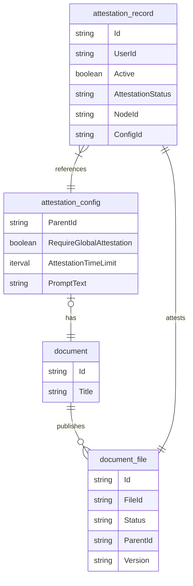
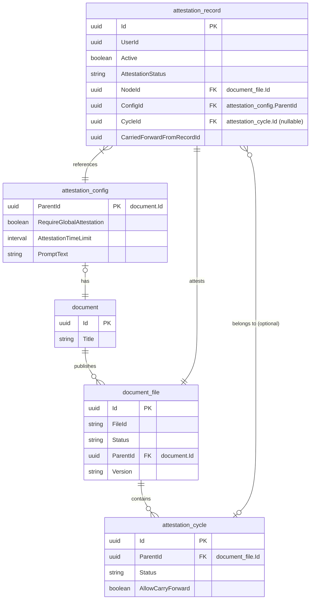

# Entity relationships

## Table of Contents

- [Entity relationships](#entity-relationships)
  - [Without attestation cycles](#without-attestation-cycles)
  - [With attestation cycles](#with-attestation-cycles)

## Without attestation cycles

## With attestation cycles

- concept of attestation cycles has been introduced. One document (or document_file) can have 0 or more attestation cycles associated with it. An attestation_record can only belong to one attestation_cycle.

