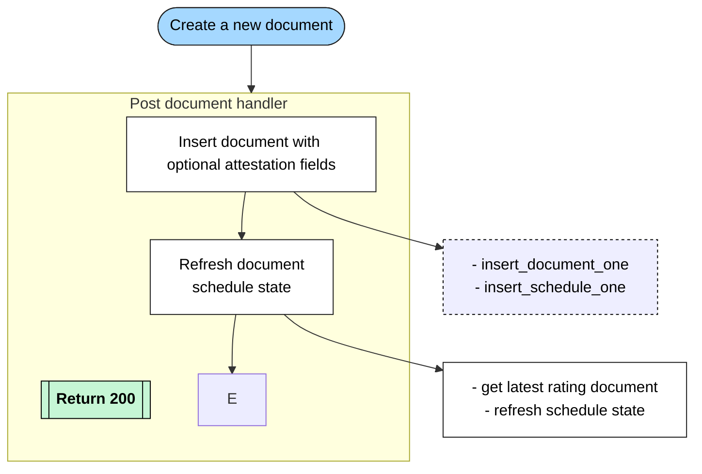
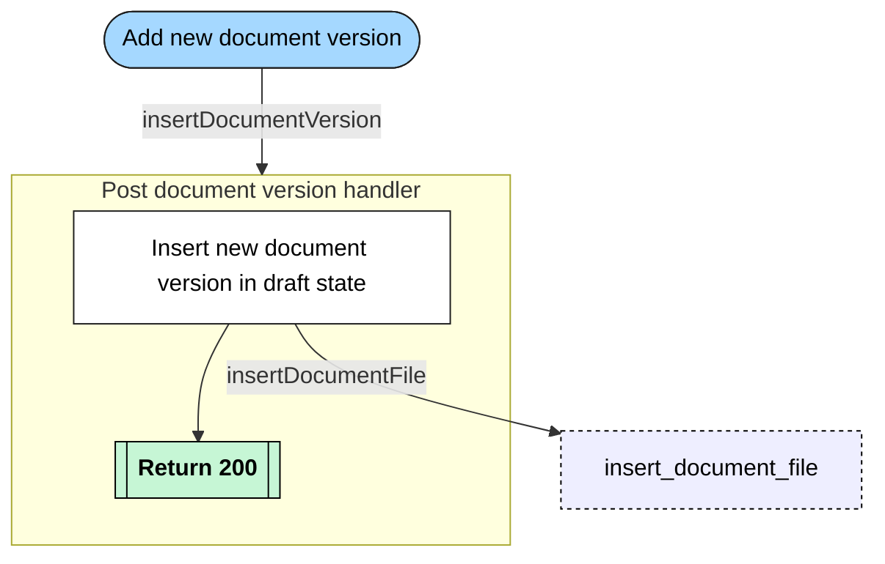
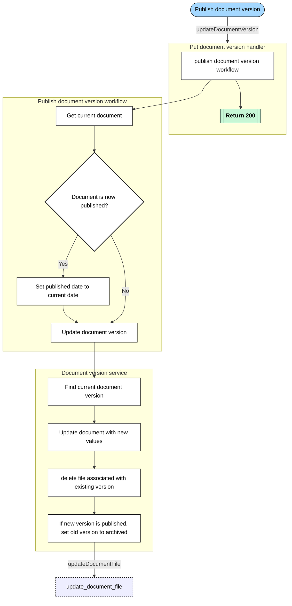

# Documents

Flows for various Policy document processes.

## Table of Contents

- [Create a new document](#create-a-new-document)
- [Add a new document version](#add-a-new-document-version)
- [Publish a document version](#publish-a-document-version)

## Create a new document

The process which is triggered when adding a new policy document via the details tab.

## Add a new document version

The process which is triggered when uploading a new policy document version

## Publish a document version

The process which is triggered when promoting a policy document version from `draft` to `published`

