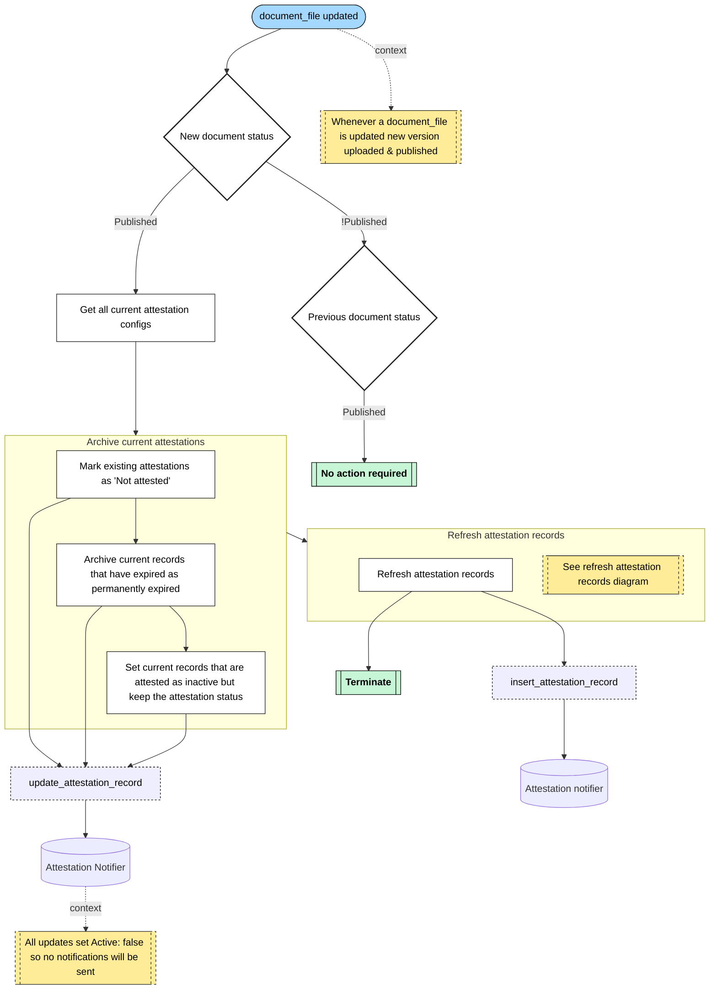
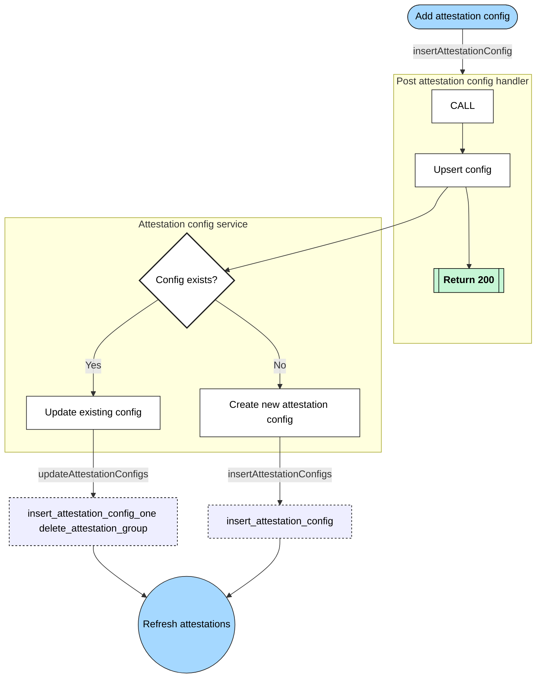
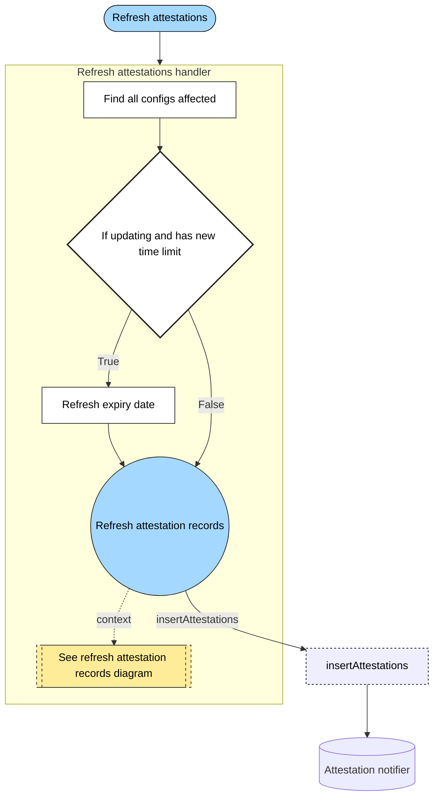
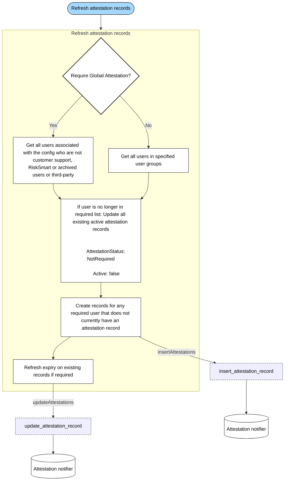

# Attestations

Flows for various Policy attestation processes.

## Table of Contents

- [Check attestations](#check-attestations)
- [Add attestation configuration](#add-attestation-configuration)
- [Refresh attestations handler](#refresh-attestations-handler)
- [Refresh attestations](#refresh-attestations)

## Check attestations

The process which is triggered whenever a change to the `document_file` sql table is detected.

## Add attestation configuration

The process which is triggered when adding attestation config via the document details form or the attestation tab in the Policy section

## Refresh attestations handler

This is the process which is triggered with any insert, update or delete to the following SQL tables:

- attestation_config
- attestation_group
- organisationuser
- user_group
- user_group_user

## Refresh attestations

This process is triggered by the processes above where indicated

