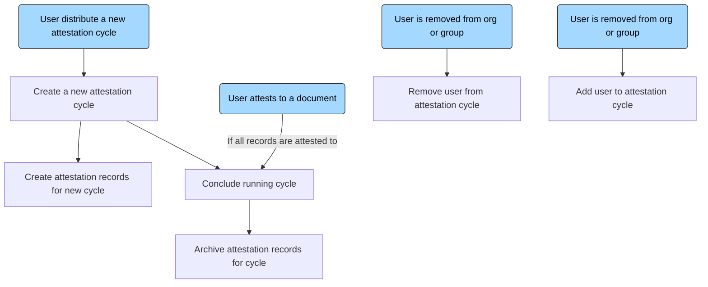
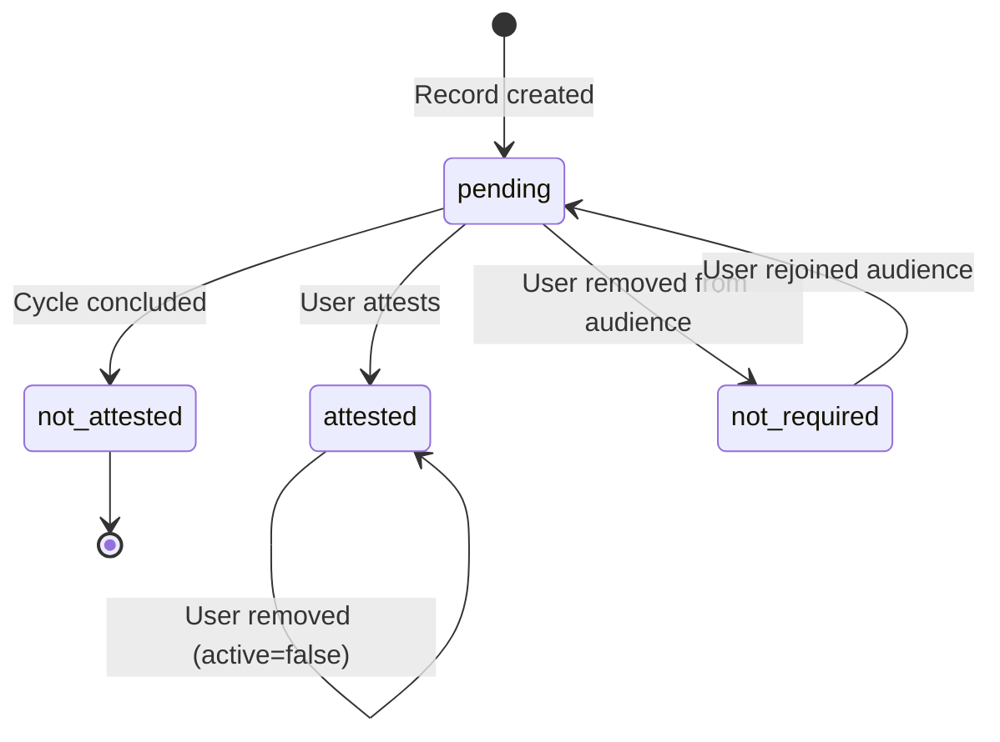
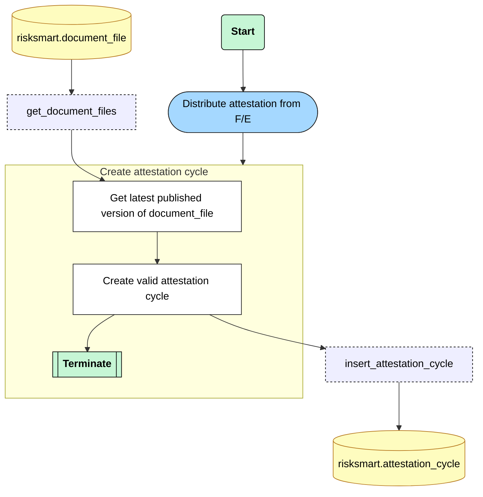
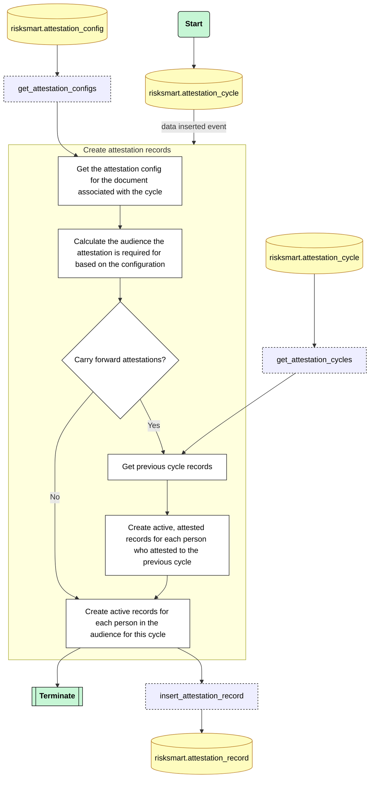
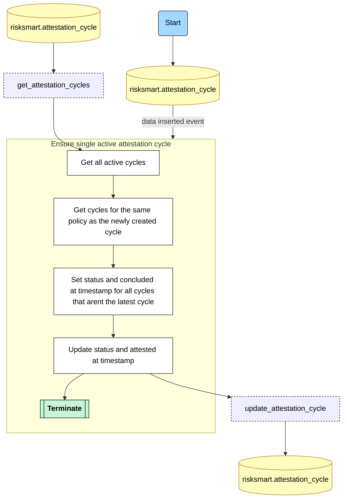
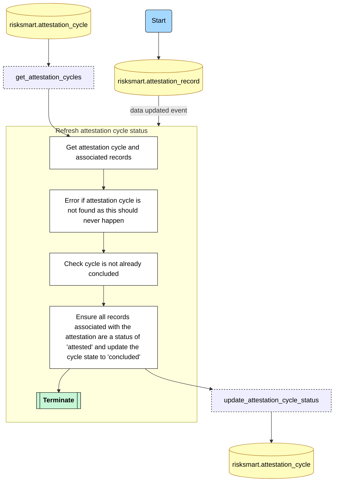
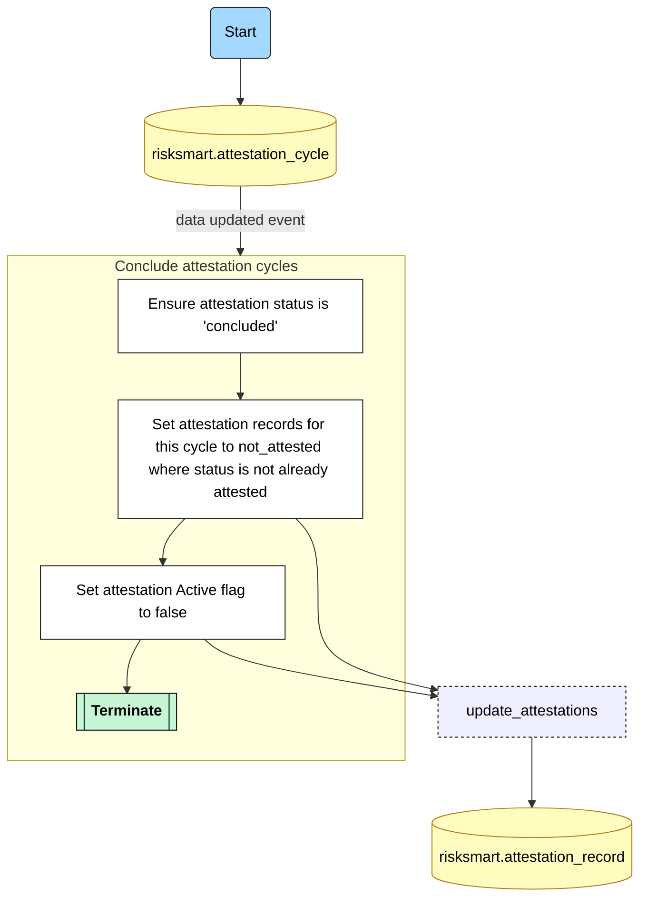
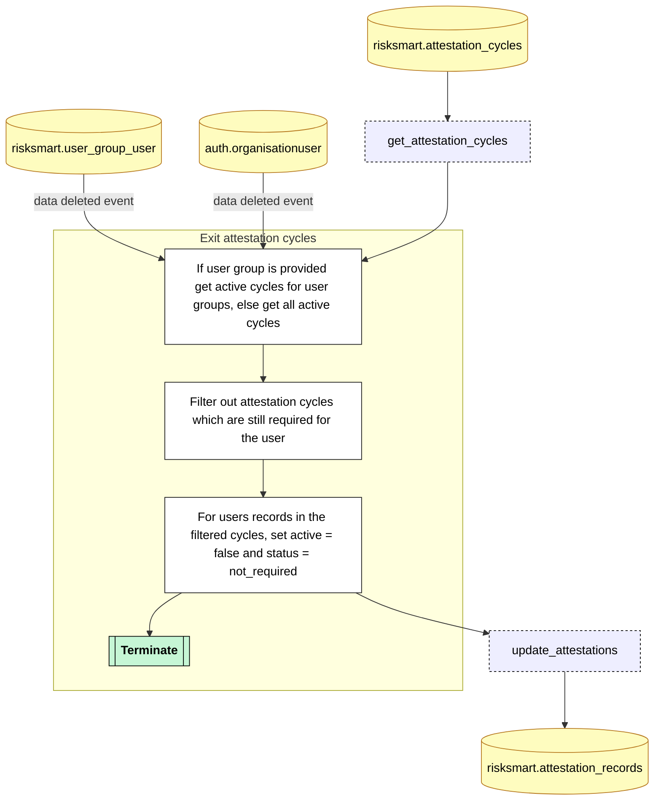
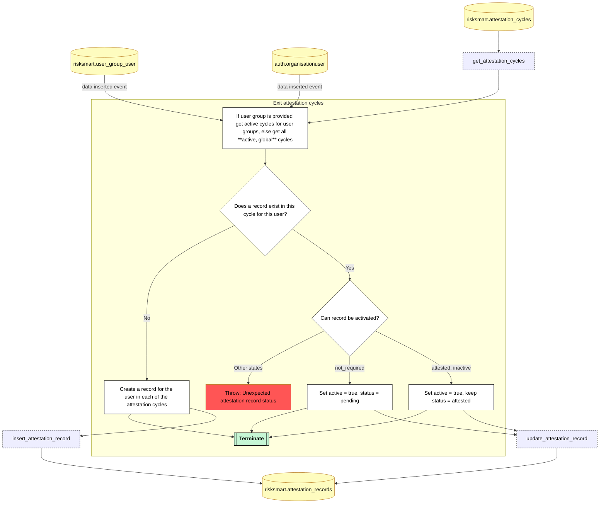

# Attestation cycles

## Table of Contents

- [Process overview](#process-overview)
- [Attestation Record State Transitions](#attestation-record-state-transitions)
- [Create a new attestation cycle](#create-a-new-attestation-cycle)
- [Create attestation records](#create-attestation-records)
- [Conclude attestation cycles](#conclude-attestation-cycles)
  - [On creation of a new attestation cycle](#on-creation-of-a-new-attestation-cycle)
  - [On completion of attestation records](#on-completion-of-attestation-records)
- [Archive attestation cycle records](#archive-attestation-cycle-records)
- [Changes to user groups and org users](#changes-to-user-groups-and-org-users)
  - [Exit attestation cycle](#exit-attestation-cycle)
  - [Enter attestation cycle](#enter-attestation-cycle)

## Process overview

## Attestation Record State Transitions

## Create a new attestation cycle

**Trigger:** User clicks the **Distribute** button in the front end.

**Action:** A new attestation cycle is created.

## Create attestation records

**Trigger:** A record is **INSERTED** into the **attestation_cycle** table.

**Action:** Individual attestation records are created for the cycle using the attestation_config. These records are created with an attestation state of **pending** and an active state of **true**

## Conclude attestation cycles

### On creation of a new attestation cycle

**Trigger:** A record is **INSERTED** into the **attestation_cycle** table.

**Action:** When a new attestation cycle is created. Any existing attestation cycles for the policy will be marked as concluded. Ensuring there is only ever one active cycle per policy.

### On completion of attestation records

**Trigger:** A record is **UPDATED** into the **attestation_record** table.

**Action:** When all the attestation_records associated with an attestation_cycle are attested, then the state of the attestation cycle will be changed to concluded

## Archive attestation cycle records

**Trigger:** A record is `UPDATED` into the `attestation_cycle` table.

**Action:** Once an attestation cycle is concluded it's records should be updated accordingly. Pending active records should have their attestation state and active state updated.

## Changes to user groups and org users

### Exit attestation cycle

**Trigger:** A record is `DELETED` from the `risksmart.user_group_user` table or the `auth.organisationuser` table.

**Action:** [RSP-1443](https://linear.app/risksmart/issue/RSP-1443/allow-inactive-users-to-be-excluded-from-an-attestation). If a user has been removed from a user group which has been assigned to an Active attestation then the status on any Active Attestations, that have not been attested to, should be set to Not required.

## Enter attestation cycle

**Trigger:** A record is `INSERTED` into the `risksmart.user_group_user` table or the `auth.organisationuser` table.

**Requirement** [RSP-1443](https://linear.app/risksmart/issue/RSP-1443/allow-inactive-users-to-be-excluded-from-an-attestation). If a user is changed from Inactive or Archived to Active, and they are part of a group that has been assigned to an Active attestation, then on the change of their user status, they should be sent the Attestation to complete.

**Action:**

