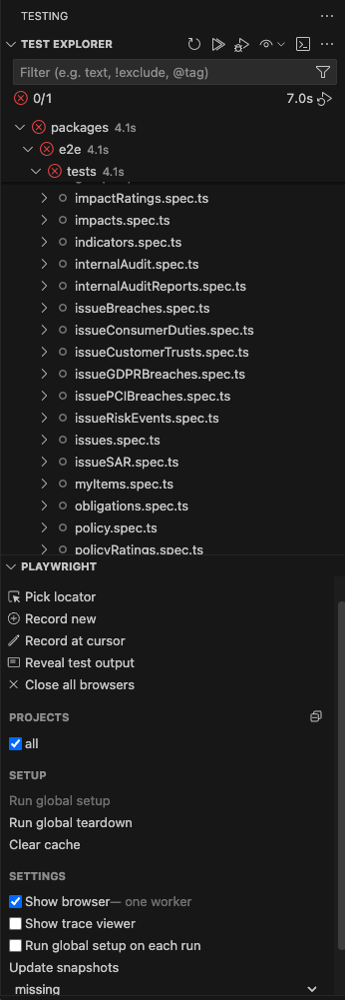
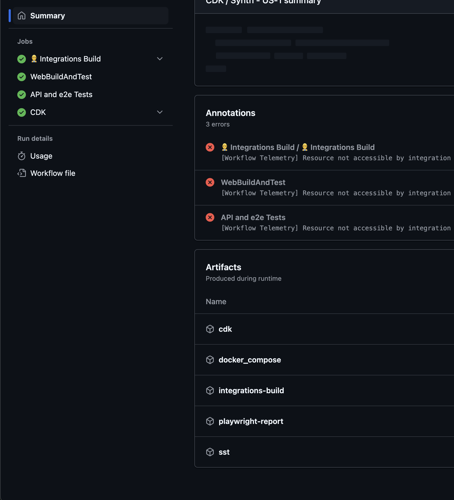

# E2E tests

`pnpm run test:e2e`

In order to run the e2e tests locally make sure to set the following environment variables (ideally in your shell config (e.g. `.bashrc` or `.zshrc`)):

`export LOGIN_PASSWORD=Password123!`

`export PR_STAGE=${your_stage_name}`

`export TECH_ADMIN_PROFILE=${your_tech_admin_profile_name}`

or in a .env file

Product lane will also need to be disabled in your react app by adding `REACT_APP_DISABLE_PRODUCTLANE=true` to your .env in the web directory

## VSCode

When debugging/creating e2e tests in TEST EXPLORER of vscode, checking "Show browser" in the settings can be helpful.

Ensure "Run global setup on each run" is checked. This ensures a new login session is created for each run.

## Debugging failing tests

Once Github actions has completed its run, the playwright-report can be downloaded from the "Artifacts" section of of the build summary.
This contains screenshots, videos and traces of failed tests.

If the test run times out, the playwright report will not be available. You can however query the results from datadog.
Navigate to "Software Delivery", "Test runs", and filter buy the branch name. By clicking on a test and viewing the trace, you can find out why a test has failed. 

