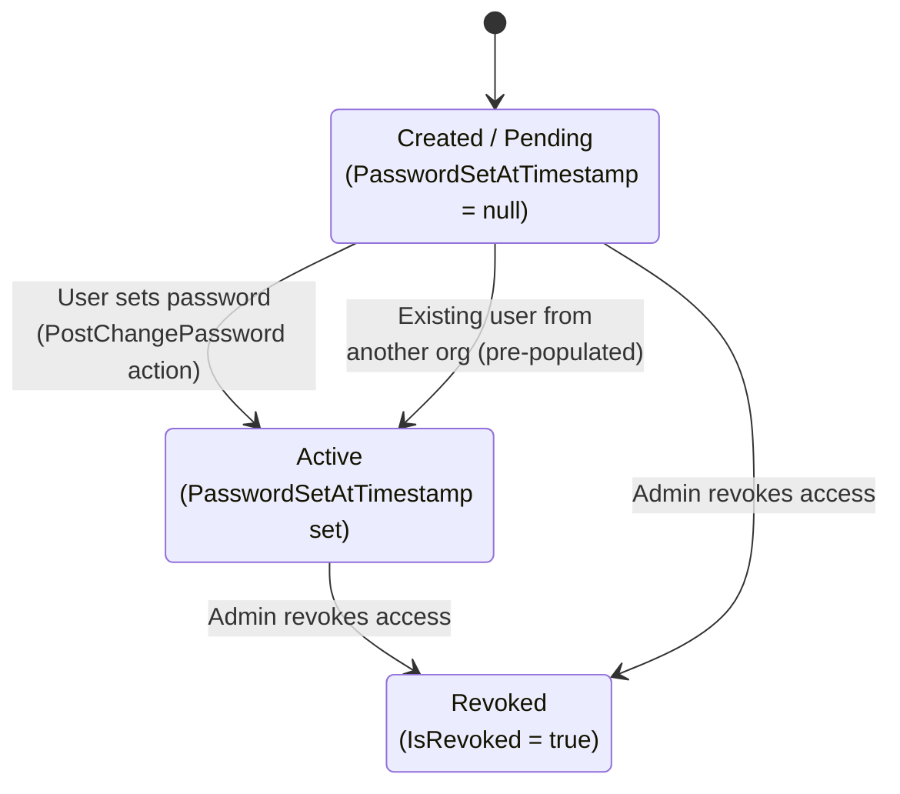
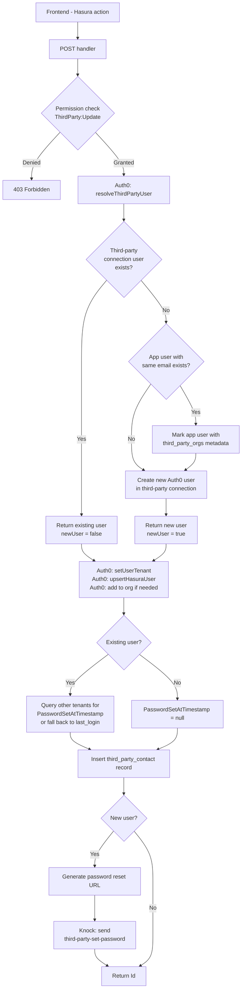
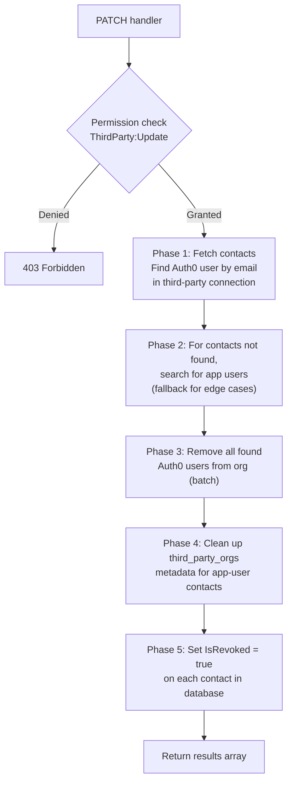
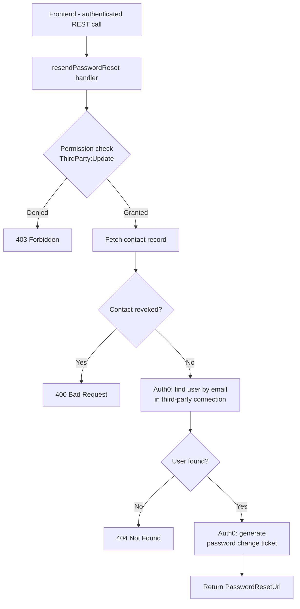
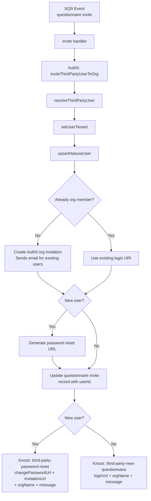

# Third-Party Contact API

This module manages third-party contacts — external users who interact with the platform (e.g. responding to questionnaires) but are not (necessarily) regular app users. Each contact is linked to a **third party** entity and has a corresponding Auth0 user account on the `Username-Password-ThirdParty` connection.

## Endpoints

| Endpoint      | Handler                  | Description                            |
| ------------- | ------------------------ | -------------------------------------- |
| POST          | `post.ts`                | Create a new third-party contact       |
| PATCH         | `patch.ts`               | Revoke access for one or more contacts |
| POST (resend) | `resendPasswordReset.ts` | Resend password reset for a contact    |

## Key Concepts

### Auth0 User Model

Third-party contacts use a **separate Auth0 database connection** (`Username-Password-ThirdParty`) from regular app users. This means:

- A third-party contact always gets their own Auth0 user in the third-party connection, even if an app user with the same email already exists in a different connection.
- The third-party portal authenticates against this connection exclusively — app connection credentials won't work there.

### Auth0 `app_metadata`

Two metadata fields on Auth0 users are central to cross-tenant behaviour:

- **`third_party_tenants`** (on third-party connection users): An array of Hasura tenant names the user has been invited to. Used by the `Update Password Set At` post-change-password Auth0 action to propagate `PasswordSetAtTimestamp` across all tenants when the user sets their password.
- **`third_party_orgs`** (on app connection users): A map of `{ [orgId]: true }` set as defence-in-depth when a regular app user is also added as a third-party contact. Allows the post-login action to assign the `ThirdPartyRespondent` role if the user accesses the org via the main app.

### Contact Status Lifecycle

A contact transitions through these states:

- **Created/Pending**: The contact record exists but the user hasn't set their password yet. `PasswordSetAtTimestamp` is `null`.
- **Active**: The user has set their password (or was already active from another org). `PasswordSetAtTimestamp` is populated.
- **Revoked**: An admin has revoked the contact's access. `IsRevoked` is `true` and the user is removed from the Auth0 organization.

---

## Flows

### 1. Creating a Contact (POST)

**File:** `post.ts`

#### Scenario A: Brand New User

1. No Auth0 user exists with this email in any connection.
2. A new user is created in the `Username-Password-ThirdParty` connection.
3. The user is added to the Auth0 organization.
4. A `third_party_contact` record is inserted with `PasswordSetAtTimestamp = null`.
5. A password reset URL is generated and sent via Knock (`third-party-set-password` workflow).

#### Scenario B: Existing Third-Party User (Same Email, Different Org/Tenant)

1. The user already exists in the third-party connection (invited to another org previously).
2. No new Auth0 user is created (`newUser = false`).
3. The current tenant is appended to `third_party_tenants` metadata.
4. The user is added to this Auth0 organization (if not already a member).
5. `PasswordSetAtTimestamp` is populated by looking up existing contact records across tenants, or falling back to `last_login` from Auth0.
6. No password reset email is sent — the user already has credentials.

#### Scenario C: Existing App User (Different Connection)

1. No third-party connection user exists, but an app user with the same email does.
2. The app user is marked with `third_party_orgs: { [orgId]: true }` in `app_metadata`.
3. A **new** third-party connection user is still created (the app connection can't authenticate on the third-party portal).
4. Proceeds as Scenario A from step 3 onwards.

---

### 2. Revoking Contacts (PATCH)

**File:** `patch.ts`

Revokes access for one or more contacts in a multi-phase process:

Key details:

- Already-revoked contacts are skipped with a message.
- Phase 2 handles the edge case where a contact was created via the app-user fallback path.
- Phase 4 removes the org entry from `third_party_orgs` on app users, and nulls out the field entirely if no orgs remain.
- The Auth0 user account itself is **not deleted** — only the org membership is removed. This allows the user to retain access to other orgs they belong to.

---

### 3. Resending Password Reset

**File:** `resendPasswordReset.ts`

A frontend-facing endpoint (not a Hasura action) that generates a fresh password reset URL for a contact who hasn't yet set their password:

The frontend receives the URL and can display it or trigger a notification. Unlike the create flow, this endpoint does **not** send a Knock notification directly — it returns the URL to the caller.

---

### 4. **TO BE DEPRECATED** - Questionnaire Invite Flow (Related)

**File:** `../third-party/invite.ts`

When a third party is invited to respond to a questionnaire, a separate SQS-driven flow handles the Auth0 and notification setup. This uses `inviteThirdPartyUserToOrg` instead of `addThirdPartyUserToOrg`:

The key difference from contact creation:

- Uses `organizations.createInvitation()` instead of `organizations.addMembers()` — this generates an invitation URL and optionally sends Auth0's built-in invitation email.
- Has idempotency checking via DynamoDB to prevent duplicate notifications.

---

## Knock Notification Workflows

| Workflow Key                    | Trigger                                | Data                                                       |
| ------------------------------- | -------------------------------------- | ---------------------------------------------------------- |
| `third-party-set-password`      | New contact created                    | `changePasswordUrl`, `loginUrl`, `orgName`                 |
| `third-party-password-reset`    | New user invited to questionnaire      | `changePasswordUrl`, `invitationUrl`, `orgName`, `message` |
| `third-party-new-questionnaire` | Existing user invited to questionnaire | `loginUrl`, `orgName`, `message`                           |

All notifications:

- Are skipped in `integration` and `IS_LOCAL` environments.
- Require notifications to be enabled for the org (checked via `isNotificationsEnabled`).
- Retry Knock user lookup up to 3 times with 1-second delays (the user may not have synced to Knock yet).

---

## Auth0 Action: Update Password Set At

**File:** `packages/auth/actions/Update Password Set At/code.ts`

A **PostChangePassword** Auth0 action that fires when a third-party user sets or changes their password:

1. Checks the connection is `Username-Password-ThirdParty` (skips otherwise).
2. Reads `third_party_tenants` from the user's `app_metadata`.
3. For each tenant, executes a Hasura admin mutation to set `PasswordSetAtTimestamp = now()` on all `third_party_contact` records matching the user's ID.

This is what transitions contacts from **Pending** to **Active** across all tenants simultaneously.

---

## Auth0 Service Layer

### `thirdPartyUserUtils.ts`

Shared utilities used by both `addThirdPartyUserToOrg` and `inviteThirdPartyUserToOrg`:

| Function                   | Purpose                                                                                                     |
| -------------------------- | ----------------------------------------------------------------------------------------------------------- |
| `resolveThirdPartyUser`    | Find or create a user in the third-party connection. Also marks existing app users with `third_party_orgs`. |
| `upsertHasuraUser`         | Insert user into Hasura `user` table. Handles uniqueness violations for legacy users.                       |
| `isOrgMember`              | Check if user belongs to an Auth0 organization.                                                             |
| `generatePasswordResetUrl` | Create an Auth0 password change ticket URL.                                                                 |
| `setUserTenant`            | Append tenant to `third_party_tenants` array in user's `app_metadata`.                                      |

### `thirdPartyContactAuth0.ts`

Utilities specific to the contact management endpoints:

| Function               | Purpose                                                |
| ---------------------- | ------------------------------------------------------ |
| `triggerPasswordReset` | Generate a password reset ticket for an existing user. |
| `removeUsersFromOrg`   | Batch-remove users from an Auth0 organization.         |

---

## Environment Variables

| Variable                            | Purpose                                                     |
| ----------------------------------- | ----------------------------------------------------------- |
| `AUTH0_THIRD_PARTY_CONNECTION_NAME` | Name of the Auth0 database connection for third-party users |
| `AUTH0_THIRD_PARTY_CLIENT_ID`       | Auth0 application client ID for the third-party portal      |
