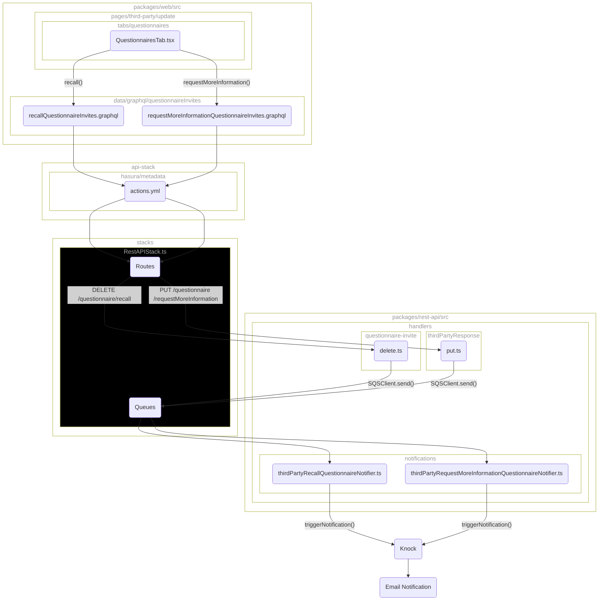

As at 20/02/2025

```mermaid
flowchart TD
  subgraph APIStackDir[api-stack]
    actionsDir
  end
  APIStackDir:::Dir

  subgraph actionsDir[hasura/metadata]
    ActionsYAML
  end
  actionsDir:::Dir

  subgraph stacksDir[stacks]
    restAPIStack
  end
  stacksDir:::Dir

  subgraph restAPIDir[packages/rest-api/src]
    handlersDir
  end
  restAPIDir:::Dir

  subgraph handlersDir[handlers]
    questionnaireInviteDir
    questionnaireResponseDir
    notificationsDir
  end
  handlersDir:::Dir

  subgraph questionnaireInviteDir[questionnaire-invite]
    QuestionnaireInviteDelete
  end
  questionnaireInviteDir:::Dir

  subgraph questionnaireResponseDir[thirdPartyResponse]
    ThirdPartyResponseUpdate
  end
  questionnaireResponseDir:::Dir

  subgraph notificationsDir[notifications]
    thirdPartyRecallQuestionnaireNotifier
    thirdPartyRequestMoreInformationQuestionnaireNotifier
  end
  notificationsDir:::Dir

  subgraph restAPIDir[rest-api]
  end
  restAPIDir:::Dir

  subgraph webDir[packages/web/src]
    thirdPartyDir
    dataDir
  end
  webDir:::Dir

  subgraph thirdPartyDir[pages/third-party/update]
    questionnairesDir
  end
  thirdPartyDir:::Dir

  subgraph questionnairesDir[tabs/questionnaires]
    QuestionnairesTab
  end
  questionnairesDir:::Dir

  subgraph dataDir[data/graphql/questionnaireInvites]
    RecallMutation
    RequestInfoMutation
  end
  dataDir:::Dir

  subgraph restAPIStack[RestAPIStack.ts]
    RestAPIStackQueues
    RestAPIStackRoutes
  end
  restAPIStack:::File

  QuestionnairesTab(QuestionnairesTab.tsx) -->|"recall()"| RecallMutation(recallQuestionnaireInvites.graphql)
  QuestionnairesTab -->|"requestMoreInformation()"| RequestInfoMutation(requestMoreInformationQuestionnaireInvites.graphql)
  RecallMutation --> ActionsYAML
  RequestInfoMutation --> ActionsYAML
  RestAPIStackRoutes(Routes) -->|DELETE /questionnaire/recall| QuestionnaireInviteDelete(delete.ts)
  RestAPIStackRoutes -->|PUT /questionnaire /requestMoreInformation| ThirdPartyResponseUpdate(put.ts)
  QuestionnaireInviteDelete -->|"SQSClient.send()"| RestAPIStackQueues(Queues)
  ThirdPartyResponseUpdate --> |"SQSClient.send()"| RestAPIStackQueues
  ActionsYAML(actions.yml) --> RestAPIStackRoutes
  ActionsYAML --> RestAPIStackRoutes
  RestAPIStackQueues --> thirdPartyRecallQuestionnaireNotifier(thirdPartyRecallQuestionnaireNotifier.ts)
  RestAPIStackQueues --> thirdPartyRequestMoreInformationQuestionnaireNotifier(thirdPartyRequestMoreInformationQuestionnaireNotifier.ts)
  thirdPartyRecallQuestionnaireNotifier -->|"triggerNotification()"| Knock(Knock)
  thirdPartyRequestMoreInformationQuestionnaireNotifier -->|"triggerNotification()"| Knock
  Knock --> EmailNotification(Email Notification)

  classDef Dir fill:transparent,color:#999
  classDef File fill:#000,color:#AAA
```
