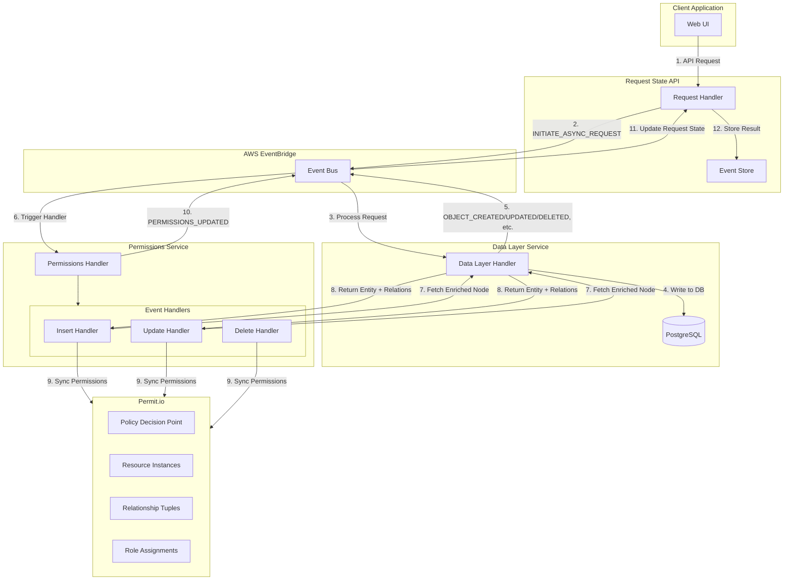
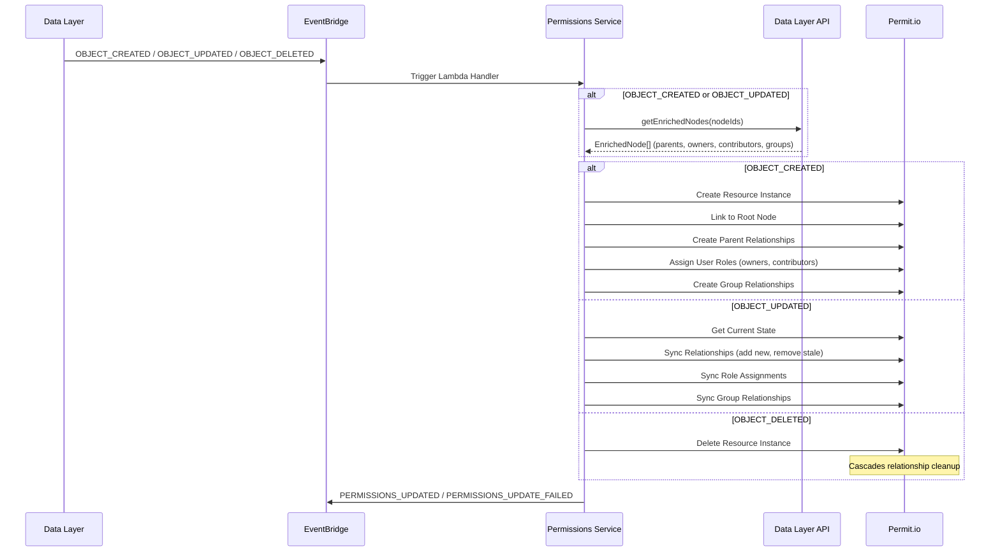
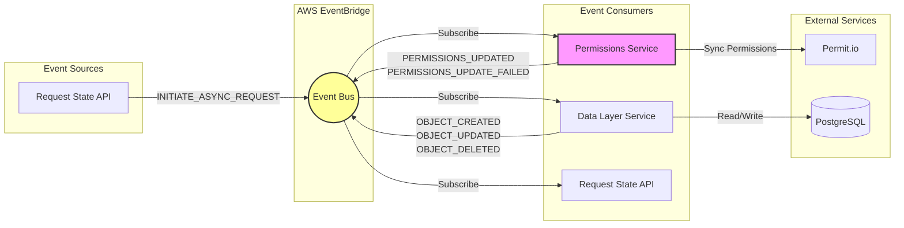

# Permissions Service

Handles data-layer events and updates Permit.io for authorization.

## Architecture Overview



## Event Flow



## V3 Event-Driven System Integration

The Permissions Service is a core component of the V3 event-driven architecture. This diagram shows how it integrates with other services:



## Glossary

| Term | Definition |
|------|------------|
| **Resource Instance** | A Permit.io representation of an entity (e.g., risk, control) with a unique key |
| **Relationship Tuple** | A connection between two resources in Permit (e.g., parent-child, group membership) |
| **Role Assignment** | Grants a user a specific role on a resource instance (e.g., owner, contributor) |
| **Enriched Node** | Entity data from data-layer including linked items, owners, contributors, and groups |
| **PDP** | Policy Decision Point - Permit's authorization engine that evaluates access requests |
| **Tenant** | Isolated organization context for multi-tenant authorization |
| **Object Type** | The type of resource (risk, control, document, etc.) mapped to Permit resource types |
| **Owner** | User role with full control over a resource |
| **Contributor** | User role with edit access to a resource |
| **Owner Group** | Group-based owner role assignment for batch permissions |
| **Contributor Group** | Group-based contributor role assignment for batch permissions |
| **Root Node** | The top-level parent resource instance (organization-level) for permission inheritance |
| **Parent-Child Relationship** | Hierarchical link enabling permission inheritance between entities |
| **Correlation ID** | Unique identifier for tracing events across the distributed system |

## Handlers

### Insert Permissions Handler

Processes object creation events. It:
1. Fetches the enriched node from the data layer (including linked items, owners, and contributors)
2. Creates a resource instance in Permit with parent-child relationships
3. Syncs user and group role assignments (owners, owner groups, contributors, contributor groups)
4. Emits a `permissions-updated` or `permissions-update-failed` event

### Update Permissions Handler

Processes object update events. It:
1. Receives a thin event with objectId and objectType
2. Fetches the enriched node from the data layer
3. Checks if the resource instance exists in Permit before proceeding
4. Compares current Permit state with desired state and syncs accordingly(adds new, removes old):
   - Parent-child relationships
   - Owner role assignments
   - Contributor role assignments
   - Owner group relationship tuples
   - Contributor group relationship tuples
   NB: Skips creation of resource and linking to root node(only done once on insert)
5. Emits a `permissions-updated` or `permissions-update-failed` event

### Delete Permissions Handler

Processes object deletion events. It:
1. Deletes the resource instance from Permit (Permit will handle the cascading unlinking of relationships and role assignments)
2. Emits a `permissions-updated` or `permissions-update-failed` event

## Running the Service via local stack

1. If not set, add correct variables in the the `cdk-stack` `.env` file. You can copy from `.env.example`:
```
TENANT_CONFIG_TABLE
LOCAL_DATABASE_CONNECTION_STRING
DYNAMODB_ENDPOINT
PDP_ENDPOINT
LOCAL_PDP_API_KEY
```

2. If not on, start the relevant containers from the root of the project:
- `docker-compose --profile v3 up --build -d --wait` to set up all the containers needed for local development.

3. Start local Lambda services (CDK synth + SAM + event routing):
```
node scripts/dev.js
```

4. Trigger a manual permission sync:
```
bash packages/permitio/sync-permit.sh
```

Alternatively, for testing just the permissions service:
Populate a test event in `services/permissions/src/tests/events` with the relevant objectId and objectType (e.g. Id found in action_update table) and run desired action e.g.:
```
cd services/permissions
pnpm run putEvent:objectDeleted
```
