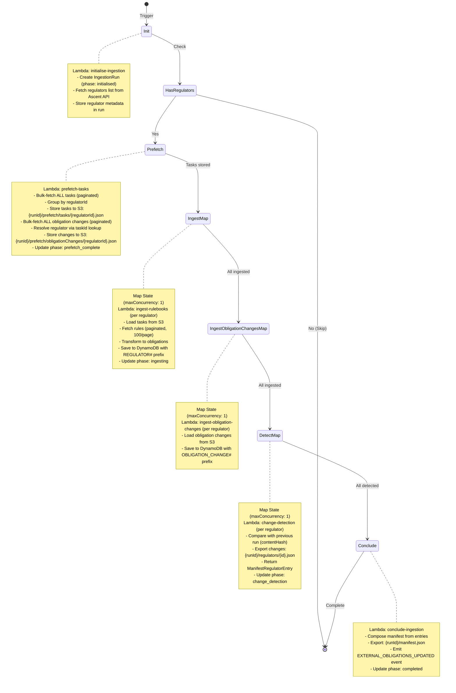

# Data Import Service

ETL pipeline for ingesting regulatory rulebooks from external providers (currently Ascent) into the RiskSmart platform. Orchestrated via AWS Step Functions state machine with multiple Lambda steps to handle large datasets and avoid timeout issues.

## Overview

The service implements a 6-phase ETL process orchestrated by Step Functions:

1. **Initialise** - Create ingestion run, fetch regulators list
2. **Prefetch** - Bulk-fetch all tasks and obligation changes, store in S3 by regulator (Ascent-specific)
3. **Ingest** - Per-regulator rule fetching and transformation (sequential)
4. **Ingest Obligation Changes** - Per-regulator obligation change ingestion from S3 (sequential)
5. **Detect Changes** - Per-regulator change detection (sequential)
6. **Conclude** - Compose manifest, emit EventBridge event, complete run

## Process Flow

### High-Level Overview



### Phase Details

#### 1. Initialise Ingestion (Lambda: `initialise-ingestion`)

```text
Input:  None (triggered manually or via EventBridge schedule)
Output: IngestionRun with phase='initialised' and regulatorProgress[]

Steps:
  1. Create ingestion run with UUIDv7 (phase: initialised)
  2. Fetch regulators list from Ascent API
  3. Initialize regulatorProgress[] with metadata
  4. Save ingestion run to DynamoDB
  5. Return ingestion run
```

#### 2. Prefetch Tasks (Lambda: `prefetch-tasks`)

**Ascent-specific**: Ascent's API does not expose per-regulator endpoints for tasks or obligation changes (Ascent: task versions). The prefetch step works around this by fetching both datasets globally, partitioning them by regulator in memory, and writing per-regulator files to S3. This manufactures the per-regulator query capability that the downstream Map states require but Ascent does not provide.

Note that rules are not prefetched because Ascent does expose a per-regulator rules endpoint (`/regulators/{id}/rules`), so the ingest step queries it directly.

Obligation changes have no regulator field in the API response. Regulator is resolved by joining against the task dataset (which is fetched first): each obligation change's `externalParentId` is a task ID, and the task's regulator is used. Obligation changes with no matching task are skipped with a warning.

```text
Input:  IngestionRun from previous step
Output: IngestionRun with phase='prefetch_complete' and totalTaskCount

Steps:
  1. Update phase to 'prefetching'
  2. Fetch ALL tasks from Ascent API (paginated, ~20MB total)
  3. Group tasks by regulatorId in memory
  4. Store per-regulator task files to S3:
     - Key: {runId}/prefetch/tasks/{regulatorId}.json
     - TTL: 7 days (lifecycle policy)
  5. Build taskId → regulatorId lookup map from fetched tasks
  6. Fetch ALL obligation changes from Ascent API (paginated)
  7. Resolve regulator for each obligation change via lookup map
  8. Store per-regulator obligation change files to S3:
     - Key: {runId}/prefetch/obligationChanges/{regulatorId}.json
     - TTL: 7 days (lifecycle policy)
  9. Calculate totalTaskCount + totalObligationChangeCount
  10. Update phase to 'prefetch_complete'
  11. Return updated ingestion run
```

#### 3. Ingest Regulators (Map State: `IngestRegulatorsSequentially`)

**Sequential processing** (maxConcurrency: 1) to respect Ascent API rate limits (200 req/min).

```text
Input:  IngestionRun from prefetch step
Iterator: $.regulatorProgress (array of regulator metadata)
Output: Array of updated IngestionRun objects

Per-regulator Lambda invocation (ingest-rulebooks):
  1. Load regulator's tasks from S3: {runId}/prefetch/tasks/{regulatorId}.json
  2. Transform tasks and save to DynamoDB
  3. Fetch rules from Ascent API (paginated, 100/page):
     - Extract hierarchy (standards/chapters) using factory pattern
     - Transform rules to domain obligations
     - Save to DynamoDB with sk: REGULATOR#{id}#OBLIGATION#{id}
  4. Update ingestionRun.regulatorProgress[i] with metrics
  5. Update phase to 'ingesting'
  6. Return updated ingestion run
```

#### 4. Ingest Obligation Changes (Map State: `IngestObligationChangesSequentially`)

**Sequential processing** (maxConcurrency: 1) to respect Ascent API rate limits.

```text
Input:  IngestionRun from ingest step
Iterator: $.regulatorProgress (array of regulator metadata)
Output: Array of updated IngestionRun objects

Per-regulator Lambda invocation (ingest-obligation-changes):
  1. Load regulator's obligation changes from S3:
     - Key: {runId}/prefetch/obligationChanges/{regulatorId}.json
  2. Save obligation changes to DynamoDB with sk: REGULATOR#{id}#OBLIGATION_CHANGE#{id}
  3. Return (no ingestion run phase changes)
```

#### 5. Detect Changes (Map State: `DetectChangesSequentially`)

**Sequential processing** (maxConcurrency: 1) to avoid race conditions on ingestion run updates.

```text
Input:  IngestionRun from ingest obligation changes step
Iterator: $.regulatorProgress (array of regulator metadata)
Output: Array of ManifestRegulatorEntry objects

Per-regulator Lambda invocation (change-detection):
  1. Query current run's obligation hashes using:
     begins_with(sk, 'REGULATOR#{regulatorId}#OBLIGATION#')
  2. Query current run's obligation change hashes using:
     begins_with(sk, 'REGULATOR#{regulatorId}#OBLIGATION_CHANGE#')
  3. Get previous successful run from DynamoDB
  4. Query previous run's hashes for this regulator (obligations + obligation changes)
  5. Compare hashes to identify added, updated, and removed items
  6. Export changes to S3: {runId}/regulators/{regulatorId}.json
  7. Return ManifestRegulatorEntry:
     {
       id, name, location,
       obligations: { added, updated, removed },
       obligationChanges: { added, updated, removed }
     }
```

**Result aggregation**: Step Functions Map state collects all ManifestRegulatorEntry objects into an array.

#### 6. Conclude Ingestion (Lambda: `conclude-ingestion`)

```text
Input:  IngestionRun + manifestEntries: ManifestRegulatorEntry[]
Output: IngestionRun with phase='completed' and manifestLocation

Steps:
  1. Compose manifest from entries:
     {
       runId,
       providerName,
       regulators: manifestEntries,
       completedAtTimestamp
     }
  2. Export manifest to S3: {runId}/manifest.json
  3. If changes detected (obligations.added + obligations.updated + obligationChanges.added + obligationChanges.updated > 0):
     - Emit EXTERNAL_OBLIGATIONS_UPDATED event to EventBridge
       with manifest location
  4. Update ingestion run phase to 'completed'
  5. Return completed ingestion run
```

## Example project structure

```text
services/rulebook-ingestion/
├── src/
│   ├── adaptors/           # Infrastructure layer
│   │   ├── ascent/         # Ascent API integration
│   │   ├── database/       # Persistence layer (DynamoDB)
│   │   └── ...             # S3, EventBridge, rate limiting adaptors
│   │
│   ├── domain/             # Business logic layer
│   │   ├── services/       # Domain services (ingestion, change detection)
│   │   └── types/          # Domain models organized by concern
│   │
│   ├── use-cases/          # Application orchestration (one per Lambda)
│   │
│   └── handlers/           # Lambda handlers (Step Function tasks)
│
└── test/                   # Test builders and mock adaptors
```

## Data Model

The service uses DynamoDB single-table design with the following access patterns:

See [docs/schema.md](./docs/schema.md) for detailed information.

## Development

### Prerequisites

Create a `.env` from the `.env.test` example and add the missing values.

### Testing

```bash
# Run unit tests only
pnpm run test:unit

# Run integration tests (requires database)
pnpm run test:integration

# Type checking
pnpm run tsc

# Linting
pnpm run lint
pnpm run lint:fix
```

## Key Concepts

### Change Detection

After transformation, the service compares the current run against the last successful run to identify:

- **Added items**: New obligations or obligation changes not in the previous run
- **Updated items**: Existing obligations or obligation changes with a changed `contentHash`
- **Removed items**: Obligations or obligation changes present in the previous run but absent in the current run

Change detection runs for both `OBLIGATION` and `OBLIGATION_CHANGE` item types, enabling incremental updates to the data-layer, avoiding unnecessary processing of unchanged items.

### Change Notification

When changes are detected, the service exports per-regulator files and publishes events:

1. **S3 Export**: Per-regulator change files + manifest:

   ```text
   s3://{bucket}/{runId}/
   ├── manifest.json              # List of regulators with counts
   └── regulators/
       ├── {regulatorId1}.json    # { regulatorId, obligations: { added, updated, removed }, obligationChanges: { added, updated, removed } }
       ├── {regulatorId2}.json
       └── ...
   ```

2. **EventBridge Event**: An org-scoped `EXTERNAL_OBLIGATIONS_UPDATED` event is published per tenant with the manifest location:

   ```json
   {
     "source": "rulebook-ingestion-service",
     "detail-type": "EXTERNAL_OBLIGATIONS_UPDATED",
     "detail": {
       "type": "EXTERNAL_OBLIGATIONS_UPDATED",
       "data": {
         "location": "s3://{bucket}/{runId}/manifest.json"
       },
       "metadata": {
         "eventId": "uuid",
         "version": "1.0",
         "timestamp": "date iso string",
         "domain": "risksmart.app",
         "service": "rulebook-ingestion-service",
         "correlationId": "uuid",
         "userId": "SYSTEM",
         "tenant": "tenant-id",
         "orgKey": "org-key"
       }
     }
   }
   ```

3. **Data Layer Ingestion**: Each tenant's data-layer receives the org-scoped event and consumes S3 changes (reading manifest to find per-regulator files)

> See [docs/process-flow.md](docs/process-flow.md) for complete end-to-end flow.

### Branded Types

Type-safe IDs prevent accidental mixing:

```typescript
type IngestionRunId = string & { __brand: 'IngestionRunId' };
type RawExternalObligationId = string & { __brand: 'RawExternalObligationId' };
// Note: Obligations use externalId (from provider) as primary identifier
```

### Per-Regulator Progress Tracking

Progress is tracked per-regulator within the ingestion run:

```typescript
type RegulatorProgress = {
  regulatorId: RegulatorId;
  regulatorName: string;
  batchesProcessed: number;
  recordsProcessed: number;
  standardsCreated: number;
  chaptersCreated: number;
  rulesCreated: number;
  tasksCreated: number;
  changes: {
    obligations: { added: number; updated: number; removed: number }; // Set during change detection
    obligationChanges: { added: number; updated: number; removed: number }; // Set during change detection
  };
};

type IngestionRun = {
  id: IngestionRunId;
  providerName: ProviderName;
  regulatorProgress: RegulatorProgress[]; // Per-regulator metrics
  phase: IngestionPhase; // Discriminated union with phase-specific metadata
  // ...
};

// Phase-based state management (discriminated union)
type IngestionPhase =
  | { type: 'initialised'; enteredAt: string }
  | { type: 'prefetching'; enteredAt: string }
  | { type: 'prefetch_complete'; enteredAt: string; totalTaskCount: number }
  | { type: 'ingesting'; enteredAt: string; regulatorsInProgress?: RegulatorId[] }
  | { type: 'change_detection'; enteredAt: string }
  | { type: 'completed'; enteredAt: string; resultLocation: string | null }
  | { type: 'failed'; enteredAt: string; error: string; failedAtPhase: string };

// Deltas are applied to the specific regulator's progress
type IngestionProgressDelta = {
  regulatorId: RegulatorId; // Identifies which regulator to update
  batchesProcessed: number;
  recordsProcessed: number;
  standardsCreated?: number;
  chaptersCreated?: number;
  rulesCreated?: number;
  tasksCreated?: number;
};
```

### Separation of Concerns

- `NewRawExternalObligation` - Transformed items with `externalParentId` and `sourceType` discriminator ('rule' | 'task')
- `UnlinkedObligation` - Standards without externalParentId
- `Obligation` - Chapters, rules, and tasks with externalParentId; includes `tags` from the provider
- `ObligationChange` - A versioned change to an obligation; `description: { before, after }` holds the full content diff for side-by-side comparison, `rationale` holds the human-readable change summary

### Hierarchy Extraction Pattern

Uses factory pattern with closure-based state for deduplication:

```typescript
const { extractRuleHierarchy } = createExtractRuleHierarchy();

// State (Sets) persists across paginated calls
for await (const page of pages) {
  const { standards, chapters } = extractRuleHierarchy(page);
  // Only new standards/chapters are returned
}
```

### Rate Limiting

Token bucket implementation respects Ascent's 200 requests/minute limit:

```typescript
const rateLimiter = new RateLimiter(
  200, // Max burst capacity
  200 / 60 // Refill rate: 200 per 60 seconds
);
```

## Extending for New Providers

To add a new regulatory data provider:

1. Create provider adaptor in `src/adaptors/[provider]/`
   - `api-adaptor.ts` - HTTP client
   - `transform.ts` - Provider JSON → Domain models
   - `types.ts` - Provider-specific Zod schemas

2. Create provider-specific query adaptor if transformation logic differs

3. Add handler in `src/handlers/ingest-[provider]-rulebooks/`
   - Wire up new adaptors in composition root
   - Reuse existing services if hierarchy matches

4. Add integration tests with mock adaptor

5. Update `providerNameSchema` in `src/domain/types.ts`

## Performance Considerations

- **Pagination:** Ascent API returns 100 records per page; processed and saved page-by-page
- **In-Memory Deduplication:** Standards/chapters deduplicated using Sets (low cardinality)
- **Content Hash:** Enables efficient change detection for incremental updates
- **Narrowed Parent Hashes:** Standards/chapters use metadata-only hashes (not full rule content)
- **Rate Limiting:** Respects provider API limits to avoid throttling

## Future Enhancements

- [ ] Metrics/observability dashboard

## Related Documentation

- [ADR: External Provider Rulebooks Storage Architecture](https://www.notion.so/risksmart/External-Provider-Regulatory-Rulebooks-Architecture-2b14cc45dc9180a89414ea790b4065bc)
