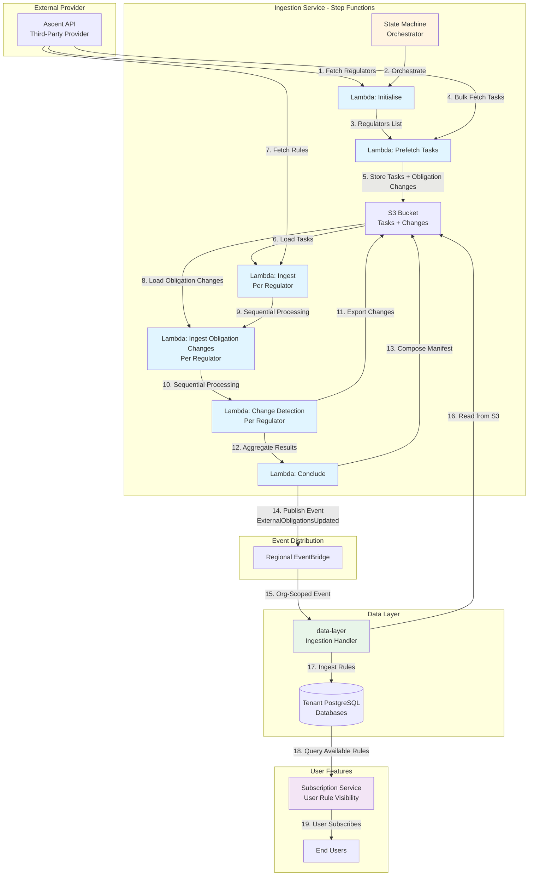

# Rulebook Ingestion Process Flow

## Overview

This document describes the end-to-end flow for ingesting external regulatory obligations from third-party providers (e.g., Ascent) and making them available to tenants for subscription.

The ingestion process is orchestrated by AWS Step Functions state machine with 6 Lambda steps to handle large datasets and avoid timeout issues.

### High-Level Architecture

## Step Functions Pipeline

The ingestion process is split into 6 distinct Lambda steps orchestrated by Step Functions:

1. **Initialise** - Create run, fetch regulators
2. **Prefetch** - Bulk-fetch tasks and obligation changes, store in S3 (Ascent-specific)
3. **Ingest** - Per-regulator rule ingestion (Map state, sequential)
4. **Ingest Obligation Changes** - Per-regulator obligation change ingestion from S3 (Map state, sequential)
5. **Detect Changes** - Per-regulator change detection for both obligations and obligation changes (Map state, sequential)
6. **Conclude** - Compose manifest, emit event, complete run

**Why Step Functions?** The monolithic Lambda approach hit timeout issues with large regulators (e.g., FCA). Breaking into steps allows each to run up to 15 minutes independently.
