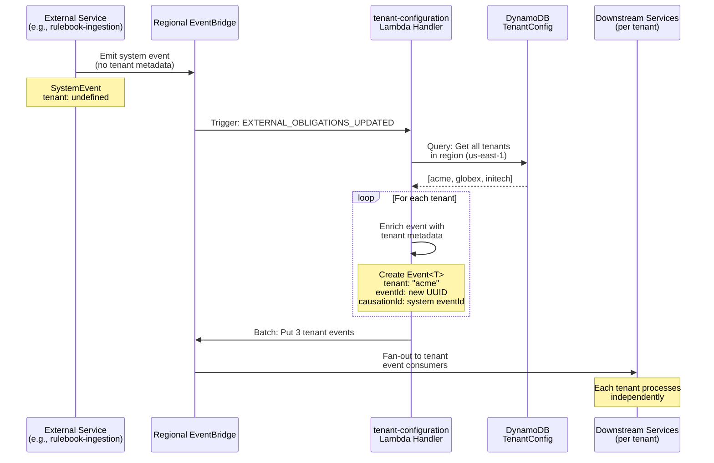

# Tenant Configuration Service

This service manages tenant configuration data and propagates regional system events to all tenants within a region. It serves as the source of truth for:

- Tenant database connection configurations (reader/writer connection strings)
- Regional tenant mappings (which tenants exist in which AWS regions)
- Organization-to-tenant relationships

The service also acts as an event fan-out mechanism, converting non-tenanted system events (e.g., `EXTERNAL_OBLIGATIONS_UPDATED`) into tenant-specific events for downstream consumption.

## Architecture

### Source of Truth

**DynamoDB Table**: `TenantConfiguration`

This table stores:

- **Tenant configurations** - Database secrets, region mappings
- **Organization configurations** - Org-to-tenant relationships

**Access patterns:**

1. Get tenant config by tenant + region
2. Get all tenants in a region
3. Get all organizations for a tenant
4. Get tenant for an organization
5. Get all organizations in a region

### Current Consumers

- `packages/drizzle` - Database connection pooling (⚠️ **Duplicate code**, will be migrated)
- `services/tenant-event-propagation` - Event fan-out (uses this service's adaptor)

### Future Enhancements

- **Tenant Configuration API** - REST/GraphQL API for downstream services to query tenant configuration
- **Package Export** - Publish `@risksmart-app/tenant-configuration` package for shared consumption
- **Tenant Registry Events** - Emit events when tenants are added/removed/updated

## Process Flow

### Event Propagation Flow



## Project Structure

```text
services/tenant-configuration/
├── src/
│   ├── handlers/                   # Lambda entry points
│   ├── domain/                     # Business logic (pure, testable)
│   │   └── types.ts                # Domain models
│   ├── adaptors/                   # Infrastructure layer
│   ├── lib.ts                      # Environment utilities
│   └── logger.ts                   # Structured logging
└── test/
    └── builders/                   # Test data builders
```

## Key Features

### 1. Event Fan-Out

Converts regional system events into tenant-specific events:

**Input** (System Event):

```typescript
{
  type: 'EXTERNAL_OBLIGATIONS_UPDATED',
  data: { location: 's3://bucket/changes.json' },
  metadata: {
    eventId: 'system-event-123',
    tenant: undefined,  // No tenant info
    orgKey: 'platform',
    correlationId: 'corr-456',
    // ...
  }
}
```

**Output** (3 Tenant Events for 3 tenants):

```typescript
[
  {
    type: 'EXTERNAL_OBLIGATIONS_UPDATED',
    data: { location: 's3://bucket/changes.json' },
    metadata: {
      eventId: 'uuid-1', // New UUID
      tenant: 'acme', // Tenant-specific
      orgKey: '', // Tenant-level event
      causationId: 'system-event-123', // Tracks origin
      correlationId: 'corr-456', // Preserved
      // ...
    },
  },
  // ... event for 'globex'
  // ... event for 'initech'
];
```

### 2. Tenant Configuration Management

Query patterns available:

```typescript
// Get specific tenant config
getTenantConfigFromDynamoDB('acme', 'us-east-1');
// Returns: { tenant, region, databases: [{secretArn, type}] }

// Get all tenants in region
getAllTenantConfigs('us-east-1');
// Returns: Array of TenantConfig

// Get all orgs for tenant
getAllOrganisationsForTenant('us-east-1', 'acme');
// Returns: Array of OrganisationConfig

// Get tenant for org
getTenantForOrganisation('org_acme_uk', 'us-east-1');
// Returns: TenantConfig

// Get all orgs in region
getAllOrganisationsForRegion('us-east-1');
// Returns: Array of OrganisationConfig
```

## Deployment

Deployed via CDK as part of the infrastructure stack:

```bash
# From cdk-stack/
pnpm run deploy:tenant-configuration
```

**Environment Variables Required:**

- `TENANT_CONFIG_TABLE` - DynamoDB table name
- `AWS_REGION` - AWS region for deployment
- `EVENT_BUS_NAME` - EventBridge bus for tenant events
- `IS_LOCAL` - Set to `'true'` for local development

## Migration Path

### For Current Consumers

⚠️ **packages/drizzle/src/utils/tenant-config.ts** contains duplicate code that should not be updated. All changes must go to this service.

**Migration steps:**

1. This service will be packaged as `@risksmart-app/tenant-configuration`
2. Update imports from `packages/drizzle` to the new package
3. Remove duplicate code from `packages/drizzle`

## Related Services

- **services/rulebook-ingestion** - Emits system events consumed by this service
- **packages/events** - Shared event type definitions
- **packages/drizzle** - Current consumer of tenant config (will be migrated)

## Clean Architecture

This service follows clean architecture principles:

See [docs/style-guides/clean-architecture.md](../../docs/style-guides/clean-architecture.md) for details.
